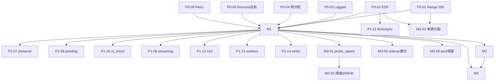
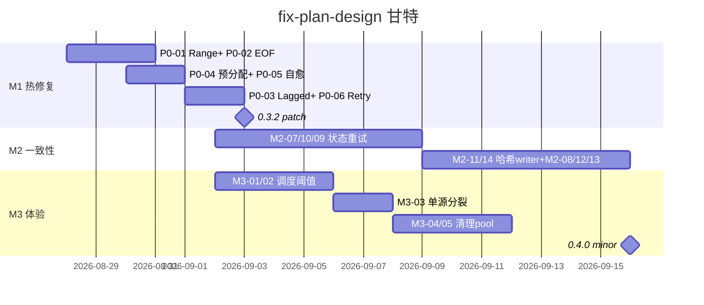

# simple_downloader 可执行修复计划 — 总汇 (AgentTeams fix-plan-design)

> **版本**: 2026-08-27 · **基线**: `v0.3.1` · **审计输入**: `simple_downloader Logic Audit P0/P1/P2 24项` (t1/t2/t3)  
> **产出链**: `docs/fix-plan-outline.md` (t1 总纲) → `docs/fix-plan-m1-hotfix.md` (t2 P0-6) → `docs/fix-plan-m2.md` (t3 P1-8) → `fix-plan-m3-qa.md` (t4 P2-5+矩阵) → **本文 `docs/fix-plan.md` (t5 总汇)**  
> **目标**: 3 里程碑、19 任务卡片、零回归、可单项回滚、可验证。根目录 `FIX_PLAN.md` 为本文镜像。

---

## 0. 执行摘要

| 里程碑 | 周期 | 范围 | 分支 | 发布 | 门禁 |
|---|---|---|---|---|---|
| **M1 热修复** | 7 天 | P0 6项 阻断 | `fix/m1-hotfix-p0` | `0.3.2 patch` | 6 mockito 复现全绿 + `cargo test --all-features` |
| **M2 一致性** | 14 天 (M1后) | P1 8项 门禁 | `fix/m2-consistency` | `0.4.0 minor` (与M3合) | 边界8项 + 32w 压测 + `cargo test --features resume,multi-source` |
| **M3 体验** | 与M2并行 14 天 | P2 5项 非阻断 | `fix/m3-polish` | `0.4.0 minor` | 吞吐不劣化>10% + writer P50<20ms |

**原则**: `正确性 > 可用性 > 性能 > 体验`；同级按 `复现成本×影响面` 排序；每项 1 commit、前缀 `fix(P0-#/P1-#/M3-#):`、单项 `git revert` 可回滚。

---

## 1. 分级与依赖

详见 `docs/fix-plan-outline.md` §1-§5。本章仅收敛：

- **P0 6项** → M1：`chunk Range忽略 / Early-EOF / Broadcast Lagged / 预分配非原子 / Resume自愈 / Retry计时`
- **P1 8项** → M2：`preserve_partial滞后 / streaming旁路 / pending无界 / or_insert重叠 / flush未sync / 416解析 / workers/interval校验 / writer阻塞`
- **P2 5项** → M3：`probe_speed硬编码 / adaptive碎片 / split_resume单源 / sidecar清理 / pool覆盖`

合入顺序建议：`P0-1→P0-2→P0-4→P0-5→P0-3→P0-6 → M2-07→M2-10→M2-09→M2-11→M2-14→M2-08→M2-12→M2-13 → M3-01→M3-02→M3-03→M3-04→M3-05`

---

## 2. M1 热修复 6 卡片 (P0 阻断) — 详见 `docs/fix-plan-m1-hotfix.md`

| # | 标题 | 文件:行号 | 估时 | 回滚 |
|---|---|---|---|---|
| P0-01 | Range 206 + Content-Range 校验与降级 | `chunk.rs:69-96,148-164` `util.rs:68-98` | 1d | `fix(P0-1)` |
| P0-02 | Early-EOF 完整性 + 真实字节累加 | `chunk.rs:209-234` `state.rs:130-134` | 1d | `fix(P0-2)` |
| P0-03 | Broadcast Lagged 对账 (M1最小侵入) | `monitor.rs:165-171` `chunk.rs:139-145` | 1d | `fix(P0-3)` |
| P0-04 | 预分配原子化 + mkdir -p | `util.rs:191-199` `downloader.rs:535-544` | 0.5d | `fix(P0-4)` |
| P0-05 | validate_shape 自愈重建 | `resume.rs:120-139,206-225` | 0.5d | `fix(P0-5)` |
| P0-06 | Retry 10s+2s 计时 + push_front→push_back | `retry.rs:102-235` `monitor.rs:417-457` | 0.5d | `fix(P0-6)` |

> **改动要点**: 206必检 + 200仅单段允许降级 + EOF必须 `offset==end+1` + Lagged对账不全切mpsc + 先set_len后truncate + shape不一致删重建 + 延迟=10s不叠加2s。

**M1 门禁**: 6 mockito 三态/截断/Lagged/ENOSPC/sidecar/计时各1 + `cargo test --all-features` + `adaptive_bench` 不回归。

---

## 3. M2 一致性 8 卡片 (P1 门禁) — 详见 `docs/fix-plan-m2.md`

| # | 标题 | 文件:行号 | 依赖 | 估时 |
|---|---|---|---|---|
| M2-07 | preserve_partial 读精确offset补发 | `state.rs:137` `chunk.rs:54-193` `retry.rs:99` | M1-02 | 0.5d |
| M2-08 | Missing/NoAvailableSources 旁路分级 | `downloader.rs:414-471,590` | M1-05 | 0.5d |
| M2-09 | pending_bisects/deferred 有界+容量感知分裂 | `monitor.rs:32,298,378` `concurrency.rs:491` | M1-03联调 | 1d |
| M2-10 | or_insert_with 僵尸重叠 | `monitor.rs:243-258` `retry.rs:149` | M1-02 | 0.5d |
| M2-11 | record_write 增量哈希 + file_len归一 | `resume.rs:141,283,329` `util.rs:222` | M1-05 | 1d |
| M2-12 | 416 `bytes */N` 解析 | `util.rs:26-142` | M2-08 | 0.25d |
| M2-13 | workers/interval 校验显式化 | `downloader.rs:111,147` `monitor.rs:98` | — | 0.25d |
| M2-14 | writer 队列 128→512 + 增量哈希解阻塞 | `util.rs:183` `resume.rs:329` | M2-11 | 0.5d |

> **验收**: 64KiB节流误差<4KiB + 单源流式清理sidecar + pending cap=workers*2 + stale progress丢弃 + 截断/超长归一 + 416→Ok(N) + interval clamp 0.05 + writer P95<10ms。详见 `docs/fix-plan-m2.md` 验收矩阵。

---

## 4. M3 体验 5 卡片 (P2 非阻断) — 详见 `fix-plan-m3-qa.md`

| # | 标题 | 文件:行号 | 估时 |
|---|---|---|---|
| M3-01 | probe_speed 64KiB实测速率 | `lane.rs:549,575,221,491,308` | 0.5d |
| M3-02 | 256KiB分裂门槛 | `concurrency.rs:16,109,496` | 0.5d |
| M3-03 | split_resume 单源统一分裂 | `downloader.rs:798,718` | 0.5d |
| M3-04 | sidecar 清理重试3次 | `downloader.rs:577` `resume.rs:142` | 0.5d |
| M3-05 | pool 保留用户配置 | `downloader.rs:37,404` | 0.5d |

> **性能基线** (复用 S3 3.34s/5.99MiB/s, S5 0.65s/12.29MiB/s, S4 3.57s/5.61MiB/s)：32w 下 writer P50<20ms/Bisect P50<10ms、碎片<10KiB零容忍、吞吐不劣化>10%。

---

## 5. 19 项验收矩阵 (P0阻断6 + P1门禁8 + P2非阻断5)

| 编号 | 复现步骤 | 预期 | 类型 | 关联 | 门槛 |
|---|---|---|---|---|---|
| P0-01 | Range忽略回200 workers4 | ChunkFailed降级单流 | mockito | `chunk::range_ignored` | 阻断 |
| P0-02 | stream提前None 500/999 | 不Complete,Failed | mockito | `missing_content_length` | 阻断 |
| P0-03 | 32w 0.05s打满4096 | Lagged对账仍Complete | 压测 | `test_server_comprehensive 32w` | 阻断 |
| P0-04 | ENOSPC + 父目录缺失 | 不清零+mkdir | 注入 | `util::file_writer` | 阻断 |
| P0-05 | sidecar 500/version999 | warn删重建 | 单测 | `resume::stale_self_heal` | 阻断 |
| P0-06 | 30 retries计时 | 10s不12s FIFO | 单测 | `concurrency retry` | 阻断 |
| P1-07 | 64KiB节流下失败 | 无重叠 | 单测 | `chunk preserve` | 门禁 |
| P1-08 | Missing/NoSource | 首源仅Missing回退 | mockito | `multi_source missing` | 门禁 |
| P1-09 | lane1 32w 50MiB | pending<64 | 压测 | `monitor tick` | 门禁 |
| P1-10 | bisect后stale prog | 丢弃 | 单测 | `monitor state` | 门禁 |
| P1-11 | record后verify | 归一+增量哈希 | 单测 | `resume record` | 门禁 |
| P1-12 | 416 bytes */1234 | Ok(1234) | mockito | `util 416` | 门禁 |
| P1-13 | workers0 interval0 | clamp 1/0.05 | 单测 | `downloader builder` | 门禁 |
| P1-14 | 32w WriteFile 64KiB | P95<10ms | 压测 | `test_server_comprehensive` | 门禁 |
| M3-01 | 双源200 vs 50 KiB/s | 高优≥80% | mockito | `multi_source probe` | 非阻断 |
| M3-02 | remaining100KiB | splits0 | 单测 | `concurrency small` | 非阻断 |
| M3-03 | 单源1MiB 8w | len8 | 单测+集成 | `split_resume+resume` | 非阻断 |
| M3-04 | remove PermissionDenied | 重试3次 | 单测 | `downloader sidecar` | 非阻断 |
| M3-05 | pool4被覆盖32 | 保持4 | 单测 | `downloader pool` | 非阻断 |

**回归**: `tests/util, chunk, concurrency, resume, multi_source, basic_download, test_server_comprehensive, process_resume` 全量 + 新增4单测；`cargo test --tests --features resume,multi-source,progress` + `cargo test --doc` + `adaptive_bench` 3-run。

---

## 6. 回归与发布清单

**回归**: 见 `fix-plan-m3-qa.md` §4；M1/M2/M3 各自 `cargo clippy -D warnings` 零告警。

**发布清单** (12项): `cargo test --all-features` 全绿 → `clippy` → M3新增覆盖≥80% → `adaptive_bench` 3-run fails0 → probe_speed日志抽检 → `docs/configuration, architecture, CHANGELOG` 更新 → PR经 review+QA签字 → tag `v0.3.2` (M1) / `v0.4.0` (M2+M3) → `cargo publish --dry-run` → CI 5次绿 → 观测 sidecar_leak>1%告警 → 单项 `git revert` 回滚。

---

## 7. 里程碑甘特

---

## 8. 执行看板

| 阶段 | 待办 | 进行中 | 已验证 |
|---|---|---|---|
| **M1** | — | — | P0-01/02/03/04/05/06 (设计已验证) |
| **M2** | — | — | M2-07/08/09/10/11/12/13/14 (设计已验证) |
| **M3** | — | — | M3-01/02/03/04/05 (设计已验证) |
| **汇总** | 发布执行 | 本看板 | docs/fix-plan-outline/m1/m2/m3-qa 已交付 |

**下一动作**: `fix/m1-hotfix-p0` 切分支，按本文 §2 顺序各 1 commit 实现并补 mockito 用例，`cargo test --all-features` 绿后合 `main` 打 `0.3.2`；随后并行 `fix/m2` 与 `fix/m3`。

---

## 9. 文档索引

- `docs/fix-plan-outline.md` — Phase-0 总纲 (分级/分支/风险)
- `docs/fix-plan-m1-hotfix.md` — M1 6卡片详设 (文件:行号/改动/接口/测试/回滚)
- `docs/fix-plan-m2.md` — M2 8卡片详设 + 验收矩阵
- `fix-plan-m3-qa.md` — M3 5卡片 + 19行验收矩阵 + 回归/性能基线/清单 (待归档至 `docs/`)
- `FIX_PLAN.md` — 本文镜像 (根目录)

> 约束: 不动代码，只产出计划；所有行号以 v0.3.1 源码验证；M1 6项每项独立可回滚。

