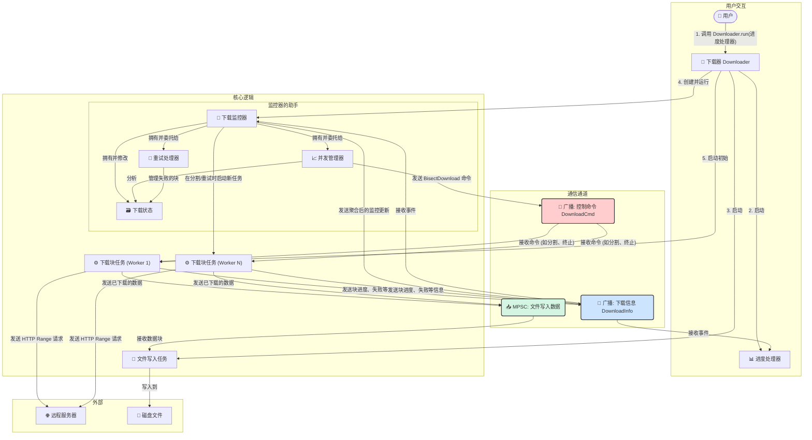

### 现有功能 (Features)

#### 1. **核心架构：消息驱动的异步设计**
- **完全异步**: 基于 `tokio` 运行时，网络和文件 I/O 均为非阻塞操作。
- **组件解耦**: `Downloader`（协调器）、`DownloadMonitorState`（状态机/大脑）、`chunk_run`（下载工蜂）和 `file_writer_task`（文件写入器）四大核心组件职责单一。它们之间通过 `tokio` 的 `broadcast` 和有界 `mpsc` 通道进行消息传递，完全解耦，易于维护。

#### 2. **自适应下载引擎**
- **动态并发控制**: 下载从单一线程启动，进入**带宽探测 (`Probing`)** 阶段。若增加并发能显著提升速度，则自动分裂任务以增加线程，直到达到并发上限或速度增益停滞，随后进入**平稳下载 (`Stable`)** 阶段，动态寻找最佳并发数。
- **智能任务调度**: 在平稳阶段，若整体速度下降或有线程空闲，会主动分裂**最慢**或**最大**的剩余任务块，实现动态负载均衡，保持下载效率。

#### 3. **健壮的错误处理与两级重试**
- **即时重试**: 下载块失败后会进入重试队列 (`retry_queue`)，在短暂延迟 (`RETRY_DELAY`) 后自动重试，以应对网络瞬时抖动。设有最大重试次数 (`MAX_RETRIES`)。
- **长延迟重试**: 当达到最大重试次数后，失败块不会被抛弃，而是被移入**延迟重试队列 (`delayed_retry_queue`)**。在经历一个更长（`DELAYED_RETRY_DURATION`）的等待期后，它将被重新放回主重试队列，极大增强了从长时间网络中断或服务器临时故障中恢复的能力。

#### 4. **精准的实时监控**
- **中心化状态管理**: `DownloadMonitorState` 统一追踪每个下载块的进度、范围、实时速度等状态。
- **平滑速度计算**: 采用 **指数移动平均（EMA）** 算法计算速度，避免瞬时波动，使速度展示更平滑、准确。
- **详细状态广播**: 通过 `DownloadInfo` 枚举广播丰富的状态事件，如块进度、整体进度、块状态变更（如：重试中、已完成）等，为 UI 对接提供了详尽的数据源。

#### 5. **高效安全的文件 I/O**
- **独立写入任务**: 文件写入在独立的 `file_writer_task` 异步任务中执行，避免了多线程写入的锁竞争。
- **反压机制**: 下载任务通过**有界 `mpsc` 通道**将数据发送给写入任务。若磁盘写入慢，通道将被填满，自动减缓下载任务的数据发送速度，有效防止内存溢出（OOM）。
- **空间预分配**: 下载开始前通过 `set_len` 预分配完整的磁盘空间，减少文件碎片。

#### 6. **高兼容性的文件信息探测**
- **智能回退 (Fallback)**: `get_file_info` 函数优先使用 `HEAD` 请求获取文件信息。若失败或响应头不完整，则自动回退至发送 `Range: bytes=0-0` 的 `GET` 请求，通过解析 `Content-Range` 头获取总大小，显著提高了对各类服务器的兼容性。

---

### 待实现的功能 (TODO List)

目标：实现一个开箱即用、自带断点续传、任务队列、对接入 UI 友好，能自适应下载的多源多线程下载库。

#### 1. **核心功能：断点续传 (Breakpoint Continuation)**
-   [ ] **进度持久化**: 创建元数据文件（如 `.download`），在程序退出时安全地将 `DownloadMonitorState` 中的分块信息（各块的起止点、已下载位置等）写入其中。
-   [ ] **任务恢复**: 程序启动时检查元数据文件。若存在，则直接读取状态并恢复下载任务，从上次中断的位置继续。

#### 2. **核心功能：多源多代理下载 (Multi-Source Downloading)**
-   [ ] **支持多个URL和多个代理同时下载一个文件**: 改造 `DownloaderConfig`，使其可接受一组镜像 URL。
-   [ ] **智能源调度**: 在 `DownloadMonitorState` 中实现源调度逻辑。例如，为每个块动态选择响应最快或历史下载速度最快的源，并能在某个源失败时自动切换到其他可用源。

#### 3. **核心功能：速度限制 (Speed Limiting)**
-   [ ] **实现可配置的速度限制器**: 允许用户设置全局下载速度上限。在 `chunk_run` 或 `monitor` 层面引入节流（throttling）逻辑，确保总速度不超过设定值。

#### 4. **其他改进**
-   [ ] **配置灵活性**: 允许用户在运行时动态调整配置，如并发数、重试策略（次数、延迟算法）等。虽然已通过 `ClientBuilder` 提供了网络层面的高度自定义能力（如代理、超时），但应用层的策略也应更灵活。


#### 示例

```rust
use simple_downloader::{Downloader, DownloadInfo, reqwest::ClientBuilder};
use tokio::sync::broadcast;

#[tokio::main]
async fn main() {
    let downloader = Downloader::new(
        "https://dldir1.qq.com/qqfile/qq/PCQQ9.7.17/QQ9.7.17.29225.exe", // 下载链接
        "QQ9.7.17.29225.exe",                             // 保存路径
        16,                                       // 最大并发线程数
        1.0,                                      // 进度更新间隔(秒)
        || ClientBuilder::new(),                  // 提供网络客户端构建器
    );

    // 定义一个处理下载进度的闭包
    let progress_handler = |total_size: u64, mut info_rx: broadcast::Receiver<DownloadInfo>| async move {
        println!("文件总大小: {:.2} MB", total_size as f64 / 1024.0 / 1024.0);

        // 循环接收并打印进度信息
        while let Ok(info) = info_rx.recv().await {
            if let DownloadInfo::MonitorUpdate { total_downloaded, total_speed, .. } = info {
                let progress = (total_downloaded as f64 / total_size as f64) * 100.0;
                println!(
                    "进度: {:.2}% | 已下载: {:.2} MB | 速度: {:.2} MB/s",
                    progress,
                    total_downloaded as f64 / 1024.0 / 1024.0,
                    total_speed / 1024.0 / 1024.0
                );
            }
        }
    };

    // 启动下载！
    match downloader.run(progress_handler).await {
        Ok(_) => println!("下载成功！"),
        Err(e) => eprintln!("下载失败: {}", e),
    }
}
```

#### 代码逻辑
