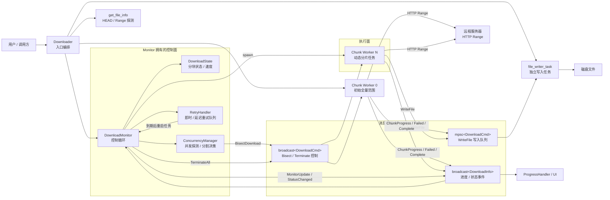

### 现有功能 (Features)

#### 1. **核心架构：消息驱动的异步设计**
- **完全异步**: 基于 `tokio` 运行时，网络和文件 I/O 均为非阻塞操作。
- **组件解耦**: `Downloader`（启动编排）、`DownloadMonitor`（控制循环）、`DownloadState`（聚合状态）、`chunk_run`（下载工蜂）和 `file_writer_task`（文件写入器）各自聚焦单一职责。它们之间通过 `tokio` 的 `broadcast` 和有界 `mpsc` 通道进行消息传递，运行期控制与执行面保持解耦。

#### 2. **自适应下载引擎**
- **动态并发控制**: 下载从单一线程启动，进入**带宽探测 (`Probing`)** 阶段。若增加并发能显著提升速度，则自动分裂任务以增加线程，直到达到并发上限或速度增益停滞，随后进入**平稳下载 (`Stable`)** 阶段，动态寻找最佳并发数。
- **智能任务调度**: 在平稳阶段，只有当整体吞吐显著回落且剩余下载时间仍然值得继续扩容时，才会优先分裂**最慢**的可分片任务块；当并发槽位回收后，也会仅在仍有足够剩余工作量时补充分片，避免因为空闲槽位或接近完成而过度切分。

#### 3. **健壮的错误处理与两级重试**
- **即时重试**: 下载块失败后会进入重试队列 (`retry_queue`)，在短暂延迟 (`RETRY_DELAY`) 后自动重试，以应对网络瞬时抖动。设有最大重试次数 (`MAX_RETRIES`)。
- **长延迟重试**: 当达到最大重试次数后，失败块不会被抛弃，而是被移入**延迟重试队列 (`delayed_retry_queue`)**。在经历一个更长（`DELAYED_RETRY_DURATION`）的等待期后，它将被重新放回主重试队列，极大增强了从长时间网络中断或服务器临时故障中恢复的能力。

#### 4. **精准的实时监控（`progress` feature）**
- **中心化状态管理**: `DownloadMonitor` 持有 `DownloadState`，统一追踪每个下载块的进度、范围、实时速度等状态。
- **平滑速度计算**: 采用 **指数移动平均（EMA）** 算法计算速度，避免瞬时波动，使速度展示更平滑、准确。
- **详细状态广播**: 开启 `progress` feature 后，可通过 `DownloadInfo` 枚举接收丰富的状态事件，如块进度、整体进度、块状态变更（如：重试中、已完成）等。

#### 5. **高效安全的文件 I/O**
- **独立写入任务**: 文件写入在独立的 `file_writer_task` 异步任务中执行，避免了多线程写入的锁竞争。
- **反压机制**: 下载任务通过**有界 `mpsc` 通道**将数据发送给写入任务。若磁盘写入慢，通道将被填满，自动减缓下载任务的数据发送速度，有效防止内存溢出（OOM）。
- **流式追加（0.5.4+）**: 不再 `set_len` 预分配，仅 `create_dir_all` 后以 `.truncate(false)` 流式追加；`ENOSPC` 在 `write/flush` 时以 `DownloadError::Io` 暴露，不残留空洞文件，详见 `src/util.rs:file_writer_task_impl`。
#### 6. **高兼容性的文件信息探测**
- **智能回退 (Fallback)**: `get_file_info` 函数优先使用 `HEAD` 请求获取文件信息。若失败或响应头不完整，则自动回退至发送 `Range: bytes=0-0` 的 `GET` 请求，通过解析 `Content-Range` 头获取总大小，显著提高了对各类服务器的兼容性。

#### 7. **断点续传 (Breakpoint Resume, `resume` feature)**
- **默认自动恢复**: 开启 `resume` feature 后，当目标文件与 sidecar 元数据同时存在时，下载器会默认尝试恢复；调用方也可通过 `with_resume(false)` 显式关闭恢复逻辑。
- **哈希校验驱动的恢复**: 续传不是简单信任文件长度，而是基于固定 segment ledger + 持久化哈希校验，仅复用已验证通过的本地字节范围。
- **按覆盖恢复而非按旧拓扑恢复**: 恢复时不会依赖上一次的 chunk 拓扑，而是重建为“已验证完成范围 + 剩余待下载范围”。
- **单源 / 多源统一恢复路径**: `Downloader::new(...)` 与 `Downloader::new_multi(...)` 都走同一套恢复模型。
- **安全失败策略**: 如果元数据存在但目标文件缺失，会直接 fail-stop，而不是静默从零开始；如果某个已验证 segment 被篡改，只会使该 segment 失效并重新下载。
- **进程级中断恢复已验证**: 当前测试已覆盖单源控制台中断后恢复，以及多源子进程被 kill / 崩溃式终止后恢复。

#### 8. **多源 / 多代理下载基础能力（`multi-source` / `proxy` features）**
- **多源入口**: `MultiSourceConfig`、`SourceConfig` 与 `Downloader::new_multi(...)` 已支持为同一个输出文件配置多个镜像 URL。
- **代理维度建模**: `SourceConfig::with_proxies(...)` 与 `LaneModel` 可把“源”或“源 + 代理”建模为调度 lane，并通过 `max_chunks_per_lane` / `max_chunks_per_source` 控制并发占用。
- **源可用性筛选**: 多源启动阶段会探测候选源；不可用、文件大小不一致或不支持 Range 的源会被跳过，全部不可用时返回 `NoAvailableSources`。
- **失败隔离**: lane 连续失败达到阈值后会进入黑名单，调度器会优先切换到其他健康 lane。
- **repo-native 验证**: `tests/multi_source.rs` 已覆盖本地 `test_server/` 的多限速源、三源异构、无效源跳过等场景；`examples/manual_multi_source_test_server.rs` 提供 500 MiB 手工观察示例；`tests/process_resume.rs` 进一步覆盖了进程级恢复。

---

### Feature Flags

当前库按“默认只保留基础能力，其他能力按需开启”的原则组织：

| Feature | 默认开启 | 作用 |
|---|---:|---|
| _none_ | 是 | 基础单源多线程下载 + 更简洁的默认 API |
| `resume` | 否 | 断点续传、sidecar 元数据、恢复相关 API |
| `multi-source` | 否 | 多源下载入口、lane 调度建模 |
| `proxy` | 否 | 代理配置能力，依赖 `multi-source` |
| `progress` | 否 | 公开 `DownloadInfo` 进度事件与 `run(...)` 进度回调接口 |
| `rate-limit` | 否 | 全局/分源限速（`governor` 令牌桶，`burst` 可配，自适应冻结） |

推荐理解方式：

- **默认模式**：`Downloader::builder(...).download().await`
- **需要恢复**：打开 `resume`
- **需要多源**：打开 `multi-source`
- **需要代理**：打开 `proxy`
- **需要 UI / 进度事件**：打开 `progress`
- **需要限速**：打开 `rate-limit`，见下节

> 完整调用形态见 [`docs/usage.md`](docs/usage.md)，`cargo doc` 见 `src/lib.rs`  crate 文档。

#### 9. **速度限制（`rate-limit` feature，`0.5.x` 新增）**
- **全局限速**：`Downloader::builder(url, path).speed_limit(bps).with_burst(bytes).download().await`，`1 token = 1 byte`，`burst` 默认 64KiB 硬限，`0` 或 `>4GiB/s` 返回 `InvalidArgument`，全局为硬上限（`per_source` 之和 > 全局时按剩余分配）
- **分源限速**：`SourceConfig::new(url).with_speed_limit(bps).with_burst(bytes)`，`MultiSourceConfig::with_global_speed_limit/with_global_burst`，分源与全局两级串联 `tokio::join` 取 `max`，避免串行 `sum` 慢 30%
- **自适应冻结**：限速启用时 `DownloadMonitor` 跳过 `ConcurrencyManager::decide_and_act`，避免限速被误判为带宽不足而过度分裂
- **校验**：`speed_limit 0` / `burst 0` / `burst需配合speed_limit` / `>u32::MAX` 均 `InvalidArgument`，`cargo test --features rate-limit,multi-source --test rate_limit` 5 用例 `5MiB@1MiB/s 4-6.5s / per_source 5-8.5s / global 3-5.5s` 全绿
- **示例**：`cargo run --features rate-limit,progress --example with_rate_limit`（单源 512KiB/s）/ `-- --multi`（多源 s1/s2 300KiB + 全局 512KiB）

---

### 待实现的功能 (TODO List)

目标：实现一个开箱即用、自带断点续传、任务队列、对接入 UI 友好，能自适应下载的多源多线程下载库。下面按“已落地 / 待完善”同步当前状态。

#### 1. **核心功能：断点续传 (Breakpoint Continuation)**
-   [x] **二进制元数据 sidecar**: 已使用 `bitcode` 持久化恢复元数据，而不是仅依赖文件长度或内存状态。
-   [x] **哈希校验恢复**: 已基于固定 segment ledger + 持久化哈希校验恢复已完成范围，不再要求保留旧 chunk 拓扑。
-   [x] **默认自动恢复 + 显式禁用**: 开启 `resume` feature 后，文件与 sidecar 同时存在时默认恢复；调用方可通过 `with_resume(false)` 强制走全新下载路径。
-   [x] **缺文件 fail-stop**: sidecar 存在但目标文件不存在时会直接报错停止，不会静默重下。
-   [x] **单源 / 多源恢复**: 已覆盖 `Downloader::new(...)` 与 `Downloader::new_multi(...)` 的恢复路径。
-   [x] **进程级恢复测试**: 已补充单源控制台中断恢复、多源 kill / 崩溃式终止恢复的集成测试。
-   [ ] **元数据 schema 演进策略**: 当前已带版本号，但后续仍可补充更完整的跨版本迁移 / 兼容策略。
-   [ ] **可观测性增强**: 后续可补充更清晰的“本次恢复复用了哪些 segment / 哪些 segment 被判定失效”的日志或事件。

#### 2. **核心功能：多源多代理下载 (Multi-Source Downloading)**
-   [x] **支持多个 URL 下载同一个文件**: 通过 `MultiSourceConfig::with_sources(...)` 配置一组镜像 URL，并使用 `Downloader::new_multi(...)` 启动多源下载。
-   [x] **支持源 / 代理 lane 建模**: 通过 `SourceConfig::with_proxies(...)`、`LaneModel::PerSource` / `LaneModel::PerSourceProxy` 表达多源多代理调度维度。
-   [x] **源可用性与一致性校验**: 启动时跳过不可用源、不支持 Range 的源，以及文件大小与首个有效源不一致的源。
-   [x] **无效源跳过与基础失败隔离**: 已有测试覆盖无效源跳过；lane 连续失败后可被黑名单隔离。
-   [x] **repo-native `test_server` 集成测试**: 已用多个不同限速的本地服务器覆盖 fast/slow、三源异构、invalid + valid 等真实 Range 下载场景。
-   [x] **手工观察示例**: `cargo run --features multi-source,progress --example manual_multi_source_test_server` 会生成 500 MiB 测试文件，启动 fast=16m / slow=2m 两个本地源，并实时刷新总进度、速度和源侧 stats 摘要。
-   [ ] **更智能的源调度评分**: 当前调度仍是基础 lane 选择与失败隔离；后续应引入响应时间、历史吞吐、失败率等动态评分，为每个块选择更优源。
-   [ ] **更完整的多代理真实集成验证**: 当前代理维度已有配置与调度模型，后续应补充真实代理链路的端到端测试矩阵。

#### 3. **核心功能：速度限制 (Speed Limiting)**
-   [x] **实现可配置的速度限制器**：`rate-limit` feature 已落地，`Downloader::builder(...).speed_limit(bps).with_burst(bytes)` 全局 + `SourceConfig::with_speed_limit/with_burst` 分源 + `MultiSourceConfig::with_global_speed_limit/with_global_burst`，`governor` 令牌桶 `1 token=1 byte`，`burst` 默认 64KiB，全局硬上限，`InvalidArgument` 校验，`monitor` 自适应冻结，`tokio::join` 双桶 `max`
-   [x] **分源 / 分代理限速策略**：全局/分源/全局+分源三档已支持，`test_server` 多源异速 + `with_rate_limit` 单/多源示例 + `rate_limit` 5 用例全绿；代理 lane 已共享分源限速（`PerSourceProxy` 同源同桶）
#### 4. **其他改进**
-   [x] **默认 API 易用性重构（第一阶段）**: 已新增 `Downloader::builder(...).download().await` 的简化入口，不再强制默认调用方接入 progress receiver。
-   [x] **Feature 能力裁剪（第一阶段）**: 默认模式仅保留基础多线程下载；`resume` / `multi-source` / `proxy` / `progress` 已拆为按需启用的 Cargo features。
-   [ ] **配置灵活性**: 允许用户在运行时动态调整配置，如并发数、重试策略（次数、延迟算法）等。虽然已通过 `ClientBuilder` 提供了网络层面的高度自定义能力（如代理、超时），但应用层的策略也应更灵活。
-   [ ] **任务队列 API**: 在单个下载任务之外，提供可暂停、恢复、取消、查询状态的任务队列抽象。
-   [ ] **更稳定的 UI 对接层**: 将 `DownloadInfo` 事件语义整理成面向 UI 的稳定契约，并补充字段兼容性说明。


#### 示例

##### 断点续传 / 进程级恢复验证

当前仓库已经内置下列恢复测试：

```bash
cargo test --features resume,multi-source --test resume -- --nocapture --test-threads=1
cargo test --features resume,multi-source --test process_resume -- --nocapture --test-threads=1
```

其中：

- `tests/resume.rs` 主要覆盖恢复元数据、损坏 segment、缺文件 fail-stop、单源 / 多源恢复与显式禁用恢复；
- `tests/process_resume.rs` 主要覆盖**真实子进程级**的中断恢复：
  - 单源：控制台中断后恢复；
  - 多源：子进程被 kill / 崩溃式终止后恢复。

##### 多源手工观察示例

如果想观察多源下载、不同源限速以及实时进度刷新，可运行：

```bash
cargo run --features multi-source,progress --example manual_multi_source_test_server
```

该示例会：

- 在系统临时目录生成一个 500 MiB 的确定性测试文件；
- 自动启动两个 repo-native `test_server/server.py` 实例；
- 将 fast 源限速为 `16m`，slow 源限速为 `2m`；
- 使用 `Downloader::new_multi(...)` 对两个本地源执行真实多源下载；
- 在终端中持续刷新总进度、总速度和 fast / slow 源侧 `/__stats__` 摘要；
- 下载完成后做字节级一致性校验，并确认两个源都参与了 Range 请求。

注意：示例中的源侧 stats 只用于观察参与度，不是精确的 per-source 吞吐率统计。

##### 基础单源用法

```rust
use simple_downloader::Downloader;

#[tokio::main]
async fn main() {
    // 示例使用公开测试文件；生产环境替换为实际 URL 即可
    match Downloader::builder(
        "https://proof.ovh.net/files/10Mio.dat",
        "10Mio.dat",
    )
    .workers(16)
    .download()
    .await {
        Ok(_) => println!("下载成功！"),
        Err(e) => eprintln!("下载失败: {}", e),
    }
}
```

##### 开启进度事件（`progress` feature）

```bash
cargo run --features progress --example with_custom_ui
```

#### 架构概览

README 中的图只保留概念级视角；更完整、权威的运行时时序、重试与动态分片细节见 [`docs/architecture.md`](docs/architecture.md)。

测试覆盖面、推荐验证命令和本地 `test_server/` 集成验证入口见 [`docs/README.md`](docs/README.md)。


```mermaid
flowchart LR
    userNode["用户 / 调用方"] --> downloaderNode["Downloader<br/>入口编排"]
    downloaderNode --> probeNode["get_file_info<br/>HEAD / Range 探测"]
    downloaderNode --> writerNode["file_writer_task<br/>独立写入任务"]
    downloaderNode --> monitorNode["DownloadMonitor<br/>控制循环"]
    downloaderNode --> initialChunk["Chunk Worker 0<br/>初始全量范围"]

    subgraph monitorBoundary["Monitor 拥有的控制面"]
        monitorNode --> stateNode["DownloadState<br/>分块状态 / 速度"]
        monitorNode --> concurrencyNode["ConcurrencyManager<br/>并发探测 / 分割决策"]
        monitorNode --> retryNode["RetryHandler<br/>即时 / 延迟重试队列"]
    end

    subgraph channelBoundary["消息通道"]
        infoBus["broadcast&lt;DownloadInfo&gt;<br/>进度 / 状态事件"]
        controlBus["broadcast&lt;DownloadCmd&gt;<br/>Bisect / Terminate 控制"]
        writerQueue["mpsc&lt;DownloadCmd&gt;<br/>WriteFile 写入队列"]
    end

    subgraph executionBoundary["执行面"]
        chunkN["Chunk Worker N<br/>动态分片任务"]
    end

    serverNode["远程服务器<br/>HTTP Range"]
    diskNode["磁盘文件"]
    progressNode["ProgressHandler / UI"]

    initialChunk -->|"HTTP Range"| serverNode
    chunkN -->|"HTTP Range"| serverNode
    initialChunk -->|"WriteFile"| writerQueue
    chunkN -->|"WriteFile"| writerQueue
    writerQueue --> writerNode --> diskNode
    initialChunk -->|"ChunkProgress / Failed / Complete"| infoBus
    chunkN -->|"ChunkProgress / Failed / Complete"| infoBus
    monitorNode -->|"MonitorUpdate / StatusChanged"| infoBus
    infoBus --> progressNode
    infoBus --> monitorNode
    concurrencyNode -->|"BisectDownload"| controlBus
    monitorNode -->|"TerminateAll"| controlBus
    controlBus --> initialChunk
    controlBus --> chunkN
    retryNode -->|"到期后重启任务"| monitorNode
    monitorNode -->|"spawn"| chunkN
```
