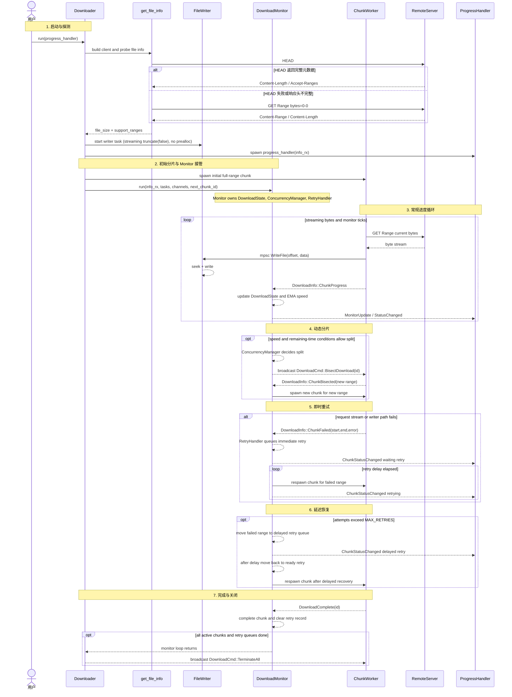

# simple_downloader 架构说明

> 本文基于当前源码的静态梳理（`src/*.rs`、`examples/*.rs`、`test_server/server.py`）。README 中的 Mermaid 图只作为概念总览；**本页是运行时流程、通道语义、动态分片与重试行为的权威说明**。

## 1. 项目概览

`simple_downloader` 是一个以 **Rust 异步并发下载** 为核心的下载器库/示例工程。整体设计是“入口编排 + 分片执行 + 监控控制环 + 消息通道”的模型：

- `Downloader` 负责构建 HTTP client、探测远端能力、启动文件写入任务、启动进度处理器、派发初始分片，并把运行期管理权交给 `DownloadMonitor`。
- `DownloadMonitor` 拥有并维护 `DownloadState`、`ConcurrencyManager`、`RetryHandler`，是运行时状态、动态分片与重试恢复的控制中心。
- `chunk_run` 是按 byte range 拉取数据的执行任务；worker 不是一次性全部预创建，而是由初始任务、分片事件或重试队列按需产生。
- `file_writer_task` 是独立写入任务，集中处理 `WriteFile`，避免多个下载任务直接竞争同一个文件句柄。
- `DownloadInfo` 和 `DownloadCmd` 是模块之间的协议边界，但 `DownloadCmd` 不是单一总线；它被用于控制广播和写入队列两类不同传输。

## 2. 目录结构

```text
src/
  chunk.rs         # 单分片下载、分片响应、写入回传（MIN_CHUNK_SIZE 10 KiB）
  concurrency.rs   # 动态并发控制、分片决策、阶段管理
  downloader.rs    # 顶层下载入口与启动编排（CHANNEL_CAPACITY 4096、MIN_PARALLEL_FILE_SIZE 1 MiB）
  monitor.rs       # 运行时控制环，拥有状态、并发管理器、重试处理器（限速冻结）
  retry.rs         # 即时重试与延迟重试队列（RETRY_DELAY 2s / DELAYED 10s / MAX 30）
  state.rs         # 分片状态与聚合下载状态（EMA smoothing 0.30）
  types.rs         # 领域消息、错误、事件协议（DownloadError 9 变体）
  util.rs          # 远端文件探测与文件写入任务（流式追加，无 set_len）
  limiter.rs       # rate-limit 令牌桶（governor 1 token=1 byte，burst 64 KiB）
  resume.rs        # 断点续传 ledger（DEFAULT_SEGMENT_SIZE 64 KiB，*.download.bitcode）
  trace.rs         # tracing 门面（init_tracing / Env::Development|Production）
  lane.rs          # 多源/代理 lane 调度（MultiRuntime、BLACKLIST 3×30s）
examples/
  download.rs
  with_custom_ui.rs
  with_rate_limit.rs
  manual_multi_source_test_server.rs
  test_server_smart_schedule.rs
  resume_harness.rs
test_server/
  server.py        # 可控测试 HTTP 服务（Range / 限速 / stats）
tests/
  chunk.rs / concurrency.rs / rate_limit.rs / util.rs / multi_source.rs / resume.rs
```

## 3. 核心模块与所有权

### 3.1 启动链路

```text
Downloader.run(progress_handler)
  ├─ build reqwest::Client（保留 pool/keepalive，用户 ClientBuilder 覆盖）
  ├─ get_file_info(HEAD；必要时回退 Range GET；206/Content-Range 为金标准)
  ├─ file_writer_task(output_path, file_size) -> mpsc<DownloadCmd>（流式追加，无 set_len；ENOSPC 在 write/flush 暴露）
  ├─ ResumePlan::prepare/restore（resume 时，hash 校验 segment，按覆盖重建范围）
  ├─ spawn(progress_handler(total_size, info_rx))
  ├─ spawn initial chunk(s) covering 全量或 resume 剩余范围
  ├─ DownloadMonitor::new(file_size, update_interval, workers).with_rate_limit(global_limiter)
  └─ monitor.run(info_rx, tasks, channels, next_chunk_id, client, writer_tx, cmd_tx, url, laneBindings, multiRuntime)
```

这条链路强调两点：

1. `Downloader` 是启动编排者，不在运行期持续直接管理 `DownloadState`、并发策略或重试队列。
2. `DownloadMonitor` 接管运行期控制后，分片扩容、失败重试、状态聚合都通过 monitor-owned helper 完成。

### 3.2 运行时协作角色

- **Chunk worker**：只处理一个当前 byte range 的网络拉取、写入请求和事件上报。它不会直接修改全局状态。
- **FileWriter**：通过有界 `mpsc<DownloadCmd>` 接收 `WriteFile`，执行 seek + write，并在结束前 flush。
- **DownloadMonitor**：消费 `DownloadInfo`，更新 `DownloadState`，定期计算速度/总进度，驱动并发分片和重试队列。
- **ConcurrencyManager**：作为 monitor 的内部策略组件，基于速度、剩余时间、稳定性采样和最大并发限制决定是否广播 `BisectDownload`；当前策略会避免在吞吐证据不足、接近完成或只是“恰好有空闲 worker 槽位”时盲目继续分片。
- **RetryHandler**：作为 monitor 的内部恢复组件，维护即时重试队列和延迟重试队列，决定失败 range 何时重新生成 chunk。
- **ProgressHandler / UI**：只消费 `DownloadInfo`，不参与调度决策。

## 4. 协议与通道图例

| 协议/通道 | 传输 | 发送者 | 消费者 | 语义 |
| --- | --- | --- | --- | --- |
| `DownloadInfo` | `broadcast<DownloadInfo>` | chunk、monitor | monitor、progress handler | 状态/进度事件协议：`ChunkProgress`、`DownloadComplete`、`ChunkFailed`、`ChunkBisected`、`ChunkStatusChanged`、`MonitorUpdate` |
| `DownloadCmd::BisectDownload` | `broadcast<DownloadCmd>` | `ConcurrencyManager` 经由 monitor tick | chunk worker | 控制命令：要求指定 chunk 自切一半，并上报新 range |
| `DownloadCmd::TerminateAll` | `broadcast<DownloadCmd>` | `Downloader` 在 monitor 返回后 | chunk worker | 控制命令：下载结束后的清理信号 |
| `DownloadCmd::WriteFile` | `mpsc<DownloadCmd>` | chunk worker | file writer task | 写入命令：有界队列提供背压，避免下载端无限积压内存 |

`DownloadCmd` 是同一个 enum，但它有两条传输路径：控制命令走 `broadcast`，写入命令走 `mpsc`。因此文档和图示中不把它描述成一个统一命令总线。

状态码来自 `DownloadInfo::MonitorUpdate.chunk_details` 和 `ChunkStatusChanged`：`0=下载中`、`1=重试中`、`2=等待重试`、`3=延迟重试`、`4=已完成`、`5=失败`。

## 5. 运行时时序图（单张分区块）

下面这张图是本文唯一的运行时时序图。它用 `Note over ...` 分区展示启动、初始分片、常规进度、动态分片、即时重试、延迟恢复、完成关闭七个阶段。



## 6. 分阶段说明

### 6.1 启动与探测

`get_file_info` 先尝试 `HEAD`，读取 `Content-Length` 与 `Accept-Ranges`。如果服务端不支持或响应头不完整，则回退到 `GET Range: bytes=0-0`，优先解析 `Content-Range`，最后才尝试普通 `Content-Length`。以 `206/Content-Range` 为金标准，`501` 等非 Range 支持会回退 HEAD 值；支持 `MissingContentLength` 自动单流流式回退（`Transfer-Encoding: chunked`）。返回值是 `(file_size, support_ranges)`。

### 6.2 初始分片与接管

`resume` 关闭时：即使配置允许多个 worker，也先创建一个覆盖完整文件范围的初始 chunk（或按 `workers` + `MIN_PARALLEL_FILE_SIZE 1 MiB` 与 `support_ranges` 降级决策）。`resume` 启用时：`ResumePlan` 基于 `64 KiB` segment 哈希校验，仅复用已验证范围，剩余按 `split_resume_ranges` 重建为待下载区间，支持单源/多源统一路径。后续是否增加 worker，由 `DownloadMonitor` 定期调用 `ConcurrencyManager` 决定；限速启用时冻结该决策。

### 6.3 常规进度循环

chunk 拉取远端字节流后（`Range 206` 强校验 + `416/200` 降级 + Early-EOF 门限），把数据通过 `mpsc<DownloadCmd>` 发送给 `FileWriter`（有界 `128` 背压，`64 KiB/50ms` 节流 `ChunkProgress`），同时通过 `broadcast<DownloadInfo>` 上报 `ChunkProgress`。monitor 消费这些事件，更新 `DownloadState` 中对应 chunk 的进度和结束位置；tick 到来时，monitor 更新 EMA 速度（`SMOOTHING_FACTOR 0.30`）并广播聚合 `MonitorUpdate`；`rate-limit` 时按 `governor` 令牌桶 `32-64 KiB` 批量 `acquire`。

### 6.4 动态分片

`ConcurrencyManager` 是 monitor 内部的决策器。它根据当前总速度、稳定性样本、剩余时间、最小分片间隔 `150ms`、最大并发数等因素决定是否发送 `BisectDownload`。当前实现的关键策略是：

- **探测阶段**：只有在正向吞吐样本表明确有带宽增益时才继续扩容；如果没有可安全切分的 range，则直接转入稳定阶段。
- **稳定阶段**：速度上升只会刷新历史基线，不会因为“速度又涨了”就立刻重新探测；只有当吞吐相对历史基线显著下降、且仍有足够剩余时间时，才尝试切分最慢的可分片 chunk。
- **补位分片**：并发槽位空出来后，也只有在当前平均速度为正、剩余完成时间仍值得分片、并且存在足够大的剩余 range 时，才会补充分片。
- **目标选择**：无论主动恢复还是补位，优先选择“剩余未下载字节数最多且仍可安全二分（`remaining >= 20 KiB`，即 `MIN_CHUNK_SIZE 10 KiB ×2`）”的 chunk，而不是按原始 chunk 总尺寸粗暴排序。

收到命令的 chunk 自己调整当前 range 并上报 `ChunkBisected`，monitor 再为新增 range 生成新 chunk（`pending_bisects` 缓冲容量不足时避免丢范围）。

### 6.5 即时重试与延迟恢复

当网络流错误或写入队列关闭导致 chunk 失败时，chunk 上报 `ChunkFailed`。monitor 将失败范围交给 `RetryHandler`：未超过 `MAX_RETRIES` 时进入即时重试队列并等待 `RETRY_DELAY 2s`；超过后进入延迟重试队列并等待 `DELAYED_RETRY_DURATION 10s`（`MAX_TOTAL_ATTEMPTS 30` 熔断 → `PermanentFailure`）。队列到期后，monitor 重新 spawn 对应 range 的 chunk；限速与重试正交。

### 6.6 完成与关闭

chunk 完成后上报 `DownloadComplete`（需 `final_downloaded==size` 且未标记失败）。monitor 标记该 chunk 完成并清理 retry 记录；当活跃任务、重试队列、`pending_bisects` 均空且 `DownloadState` 判断文件已完成时，monitor loop 返回。随后 `Downloader` 广播 `TerminateAll` 做最终清理，成功后删除 `*.download.bitcode`（带 `PermissionDenied` 指数退避重试）。

## 7. 源码映射

- 启动与编排：`src/downloader.rs`
- 文件信息探测与写入任务：`src/util.rs`（`get_file_info` / `file_writer_task` 流式）
- monitor 主循环与运行时接管：`src/monitor.rs`（`DownloadMonitor::run`）
- 动态分片策略：`src/concurrency.rs`（`ConcurrencyManager`）
- 重试队列与延迟恢复：`src/retry.rs`（`RetryHandler`）
- chunk 下载、切分、写入、事件上报：`src/chunk.rs`（`chunk_run`、`MIN_CHUNK_SIZE`）
- 状态与 EMA 速度：`src/state.rs`（`DownloadState`/`ChunkState`）
- 限速令牌桶：`src/limiter.rs`（`RateLimiter`）
- 断点续传：`src/resume.rs`（`ResumeMetadata` / `ResumePlan`）
- 可观测性门面：`src/trace.rs`（`init_tracing`）
- 多源/代理调度：`src/lane.rs`（`MultiRuntime` / `LaneScheduler`）
- 消息协议：`src/types.rs`（`DownloadInfo` / `DownloadCmd` / `DownloadError`）

- 新调度策略优先扩展 `concurrency.rs`，并保持由 `DownloadMonitor` 调用。
- 新重试策略优先扩展 `retry.rs`，不要让 chunk 直接持有全局恢复状态。
- 新 UI 或 CLI 进度展示应消费 `DownloadInfo`，不要读取 monitor 内部状态。
- 新存储后端可以替换 `file_writer_task` 背后的实现，但仍应保留有界写入队列提供背压。
- 新测试场景可以扩展 `test_server/`，模拟限速、断连、慢流、Range 兼容性等场景。

## 9. 一句话总结

`simple_downloader` 的运行时核心不是“预先启动固定数量 worker”，而是：`Downloader` 完成启动编排，`DownloadMonitor` 拥有状态/并发/重试控制面，chunk worker 按需执行 byte range，所有边界通过明确的 `DownloadInfo` 和双传输 `DownloadCmd` 协议连接。
