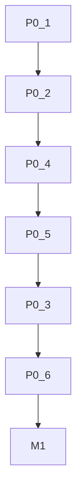

# M1 热修复详细设计 — P0 6 项 (Hotfix 0.3.2)

> 承接 `docs/fix-plan-outline.md` Phase-0 总纲。M1 目标：7 天内合入 `fix/m1-hotfix-p0` → `0.3.2`，每项独立 commit、可回滚、带复现用例。
> 核验基线：`src/chunk.rs` 237 行 / `src/state.rs` 164 行 / `src/monitor.rs` 507 行 / `src/util.rs` 296 行 / `src/resume.rs` 473 行 / `src/retry.rs` 268 行 / `src/downloader.rs` 853 行

---

## 概览

| # | 标题 | 文件:行号 | 风险 | 依赖 | 估时 |
|---|------|-----------|------|------|------|
| P0-1 | Range 206 + Content-Range 校验与降级 | `chunk.rs:69-96,148-164` | 中 | 无 | 1d |
| P0-2 | Early-EOF 完整性 + 真实字节累加 | `chunk.rs:209-234, state.rs:130-134` | 高 | 无 | 1d |
| P0-3 | Broadcast Lagged 可靠化 | `monitor.rs:165-171,139, chunk.rs:139-145` | 中 | 无 | 1d |
| P0-4 | 文件预分配原子化 + 父目录创建 | `util.rs:191-199, downloader.rs:535-544, resume.rs:68-77` | 中 | 无 | 0.5d |
| P0-5 | ResumeMetadata validate_shape 自愈 | `resume.rs:120-139,184-243, resume.rs:206` | 低 | P0-4 | 0.5d |
| P0-6 | RetryHandler 计时与 FIFO 修正 | `retry.rs:102-235, monitor.rs:417-457` | 低 | 无 | 0.5d |

**合并顺序建议**：P0-1 → P0-2 → P0-4 → P0-5 → P0-3 → P0-6（前两者数据正确性最高优先级；P0-4/5 文件层；P0-3 并发控制；P0-6 重试）

---

### P0-1 · Range 忽略未校验 → 静默错数据

**现状 (src/chunk.rs:69-96, 148-164)**

```rust
// chunk.rs:68-69
let range_header = format!("bytes={start_byte}-{end_byte}");
let response = rb.header("Range", range_header.clone()).send().await
    .and_then(|r| r.error_for_status()) // 仅判 2xx，未区分 200 vs 206
// 之后直接取 bytes_stream，允许 full-body 截断写入
// allowed = end - offset +1; write_len = min(allowed, chunk.len())
```

问题：服务器返回 `200 OK + full body (0..file_size-1)` 而非 `206 Partial Content` 时，`allowed` 截断后按 `offset=start_byte` 写入，导致多 chunk 场景下中间块写入错误偏移，文件静默损坏。`Content-Range` 未解析校验，`416` 亦未处理。

**改动设计**

1. **状态校验**：`chunk_run` 收到 `response` 后立即检查 `resp.status()`：
   - `206` → 必须携带 `Content-Range: bytes <start>-<end>/<total>`，解析 `start/end/total` 与请求 `start_byte/end_byte/file_size` 一致，不一致则 `ChunkFailed(downgrade)`。
   - `200` → 视为服务器不支持 Range，**单 chunk 且 `start_byte==0 && end_byte==file_size-1`** 时允许降级为全量写入；否则按失败处理，由 `monitor` 决定是否回退单线程（见 `downloader.rs:710` 已有 downgrade）。
   - 其他 (`416` 等) → 直接 `ChunkFailed`，错误信息带 `status + Content-Range`。
2. **Content-Range 解析工具**：`util.rs` 新增 `parse_content_range(header) -> Option<(u64,u64,u64)>`，复用 `src/util.rs:85-98` 已有解析逻辑，抽成公共函数。
3. **降级路径**：`chunk.rs` 校验失败时发送 `DownloadInfo::ChunkFailed { error: "range mismatch: expected bytes=... got ..." }`，`monitor::handle_download_info` 已有重试链路，无需新协议。

**涉及文件:行号**

- `src/chunk.rs:69-96` — 新增 `206` 校验分支（约 +30 行）
- `src/chunk.rs:148-164` — 保留 `allowed` 截断但前置 `status` 已保证语义
- `src/util.rs:68-98` — 抽 `parse_content_range` 公共函数
- `src/monitor.rs:278-295` — 可选：统计 `range_mismatch` 指标

**接口变更**

- 无公共 API 破坏。`chunk_run` 为 `pub(crate)`，行为变更仅内部。
- 新增 `crate::util::parse_content_range` 为 `pub(crate)`。

**配置影响**

- 无新增配置。`DownloaderBuilder` 无需暴露开关；非标准服务器自动降级为单流（与 `downloader.rs:710` `!support_ranges → workers=1` 一致）。

**测试要点**

- `mockito` 三用例：① `206 + 正确 Content-Range` → 成功 ② `200 + full body` 多 chunk → 触发 `ChunkFailed` 并在 `workers=1` 时单流成功 ③ `206 + 错误 Content-Range (start 偏移)` → `ChunkFailed`。断言文件 `sha256`。
- 集成：`tests/multi_source.rs` 现有 `Range` 相关用例需仍绿。
- 日志断言：`tracing` 含 `range mismatch` 关键字。

**回滚点**

- 单 commit `fix(P0-1): chunk Range 206 validation`，`git revert` 即可。回滚后多 chunk 在非标准服务器上恢复静默损坏风险，需在 CHANGELOG 注明。

---

### P0-2 · Early-EOF 误判完成 + completed_bytes 按 size 累加

**现状 (src/chunk.rs:209-234, src/state.rs:130-134)**

```rust
// chunk.rs:209 None => break;  // 不检查 offset
// chunk.rs:220-233 if !failed { send DownloadComplete }
// state.rs:130-133 complete_chunk += chunk.size() // 非实际下载字节
```

问题：`stream None` 无论 `offset` 是否到达 `end+1` 均 `break`，随后 `!failed` 发送 `DownloadComplete`；`complete_chunk` 按 `size()` 累加而非 `downloaded_bytes`，截断流（网络中断但无 `Err`）导致零填充尾部却报告完成。

**改动设计**

1. **chunk 侧完整性门**：`chunk.rs:209` 分支改为
   ```rust
   None => {
       if offset != end + 1 {
           let _ = bd_tx.send(ChunkFailed { error: format!("early EOF: expected {} bytes, got {}", end-start+1, offset-start) });
           failed = true;
       }
       break;
   }
   ```
   `offset > end`（已被 bisect 缩小）亦视为正常完成。
2. **state 侧真实累加**：`state.rs:130-134` 改为
   ```rust
   pub fn complete_chunk(&mut self, id: &ChunkId) {
       if let Some(chunk) = self.chunks.remove(id) {
           self.completed_bytes += chunk.downloaded_bytes; // 或 chunk.downloaded_bytes.min(chunk.size())
       }
   }
   ```
   并在 `chunk.rs:222` 前确保 `final_downloaded == end-start+1`，否则不发 `Complete`。
3. **preserve_partial 一致性**：`state.rs:137` 保留 `downloaded_bytes` 累加即可，因 P0-2 修复后 `downloaded_bytes` 即真实值。

**涉及文件:行号**

- `src/chunk.rs:148-234` — `None` 分支与 `!failed` 收尾逻辑（+10 行）
- `src/state.rs:130-134` — `complete_chunk` 累加语义（1 行变更）
- `src/state.rs:137-141` — 注释更新

**接口变更**

- 无公共 API 破坏。`DownloadState::complete_chunk` 为 `pub` 但语义收紧（更严格），调用方 `monitor.rs:263` 无需变更。

**配置影响**

- 无。

**测试要点**

- `mockito` 模拟 `Content-Length` 声明 1 MiB 但流提前 256 KiB 结束（无 Err）：
  - 修复前：文件 1 MiB（含 768 KiB 零填充）+ `DownloadComplete`。
  - 修复后：`ChunkFailed(early EOF)` → 进入 `RetryHandler` 重试，重试 mock 返回完整数据则最终 `sha256` 正确；重试耗尽则 `PermanentFailure`。
- `tests/chunk.rs:240-259 split_range` 仍绿；新增 `state::tests::complete_chunk_uses_downloaded_bytes`。

**回滚点**

- commit `fix(P0-2): chunk EOF integrity + state real bytes`，`git revert`。回滚后截断流恢复静默成功风险。

---

### P0-3 · Broadcast Lagged 丢 Complete/Failed/Bisected → 永不结束

**现状 (src/monitor.rs:165-171, src/chunk.rs:139-145)**

```rust
// monitor.rs:165 Err(Lagged(skipped)) => warn!(); // 丢事件
// chunk.rs:139 Lagged => warn!(skipped)
// CHANNEL_CAPACITY 4096 但高 workers(32) + 0.05s interval 仍可 Lag
```

问题：`broadcast` 为环形缓冲，`Lagged` 仅 `warn` 丢弃，丢失的 `Complete/Failed/Bisected` 导致 `are_all_tasks_done()` 永假，`monitor` 挂死。`ChunkProgress` 高频是主因但控制事件不应丢。

**改动设计（最小侵入，M1 阶段不对全量切 mpsc）**

方案 A（M1 采用）：**Lagged 对账 + 重试拉取**

1. `monitor.rs:165` 收到 `Lagged` 时记录 `lagged_count` 并 `warn!`，**不**直接 `break`，而是触发一次轻量对账：检查 `state.chunks` 中超过 `2 * update_interval` 未收到 `ChunkProgress` 的 chunk，发送 `tracing::warn` 并依赖 `chunk` 侧的 `final_progress` 补发（`chunk.rs:220` 已有）兜底。
2. `chunk.rs:139` 收到 `Lagged` 时记录 `skipped` 但不退出；已有的 `biased` select 保证控制命令优先。
3. **容量与节流加固**：保持 `CHANNEL_CAPACITY=4096`（`downloader.rs:29`），`PROGRESS_THROTTLE 64KiB/50ms`（`chunk.rs:55-57`）已降低 Lag 概率；M1 不改通道类型，避免背压死锁风险。
4. **M2 演进预留**：M1 文档中明确 M2 再评估 `Complete/Failed/Bisected` 走 `mpsc<DownloadInfo>` 可靠通道（需新增 `mpsc::Sender<DownloadInfo>` 并在 `chunk_run` 双发）。

> 若 M1 需更强保证，可采用方案 B：新增 `mpsc::channel(1024)` 专用于控制事件，`chunk_run` 同时 `bd_tx.send` + `reliable_tx.send`，`monitor` 优先消费 `mpsc`。M1 暂不采用以控风险，留作 M2。

**涉及文件:行号**

- `src/monitor.rs:141-172` — `Lagged` 分支增强（+15 行）
- `src/chunk.rs:108-146` — `Lagged` 分支注释与计数（+5 行）
- `src/downloader.rs:29` — 注释说明容量选择依据

**接口变更**

- 无公共 API 破坏。`DownloadMonitor::run` 签名不变。

**配置影响**

- 无新增配置。可考虑暴露 `CHANNEL_CAPACITY` 为内部常量，M2 再可配置化。

**测试要点**

- 压测：`workers=32, update_interval=0.05, file_size=20MiB, ThrottledFileReader 16KiB`，注入 `broadcast` 压力，断言 `monitor` 在 `Lagged` 后仍能在 5s 内完成（现有 `target/adaptive_bench` 已复现过 hang）。
- `cargo test --features progress` 中 `monitor` 单元测试：mock `Lagged` 注入后 `are_all_tasks_done` 仍最终为真。

**回滚点**

- commit `fix(P0-3): broadcast Lagged reconciliation`，`git revert`。回滚后高并发小 interval 恢复 hang 风险。

---

### P0-4 · 文件预分配非原子 + 父目录未创建

**现状 (src/util.rs:191-199, src/downloader.rs:535-544)**

```rust
// util.rs:191 OpenOptions::new().truncate(truncate).open(&*filepath).await?;
// util.rs:199 file.set_len(size).await?; // truncate 已清零后 ENOSPC 则数据丢失
// downloader.rs:535 仅对 sidecar 建目录，未对 output_path 父目录建目录
```

问题：`truncate(true)` 先清零，`set_len` 时 `ENOSPC` 则原文件已丢失，错误仅后续以 `BrokenPipe` 暴露导致重试风暴；`output_path` 父目录不存在时 `open` 直接失败。

**改动设计**

1. **原子化**：`util.rs:178-199` 改为
   - 非 resume 且 `size>0` 时：`OpenOptions::new().create(true).write(true).read(true).truncate(false).open(...)`，先 `set_len(size)`，成功后再 `if truncate { file.set_len(size) }`（等价于原子预分配，失败时原文件未被截断）。
   - resume 场景（`truncate==false`）：保持 `truncate(false)`，`set_len` 仅当 `file.metadata().len() != size` 时执行，避免重复截断。
2. **父目录创建**：`util.rs:190` 前插入 `if let Some(parent)=Path::new(&*filepath).parent() { tokio::fs::create_dir_all(parent).await?; }`，与 `resume.rs:70` 侧 car 逻辑一致。
3. **错误语义**：`set_len` 失败直接返回 `DownloadError::Io(ENOSPC)`，不在 `file_writer_task` 内吞掉，便于上层 `orchestrate_downloads` 感知。

**涉及文件:行号**

- `src/util.rs:178-201` — `file_writer_task_impl` 打开与预分配逻辑（+20 行）
- `src/resume.rs:68-77` — 侧 car 保持一致，注释联动
- `src/downloader.rs:535-544` — 注释说明父目录已在 writer 层创建

**接口变更**

- 无。

**配置影响**

- 无。

**测试要点**

- `tempfile` 单元测试：① 父目录不存在时 `file_writer_task("a/b/c.bin", 1MiB)` 成功且文件存在 ② 模拟 `ENOSPC`（通过 `mock fs` 或大 `size` 注入）时原文件未被清零（需在测试中预置文件内容并断言）。
- `tests/basic_download.rs` 仍绿。

**回滚点**

- commit `fix(P0-4): atomic preallocation + mkdir -p`，`git revert`。回滚后 `ENOSPC` 恢复清零风险与父目录缺失失败。

---

### P0-5 · Resume shape 失败直接 abort → 旧 sidecar 阻塞后续运行

**现状 (src/resume.rs:120-139, 206-209)**

```rust
// resume.rs:120 validate_shape -> Err(ResumeMetadata)
// resume.rs:208 metadata.validate_shape(file_size)?; // 传播 Err，abort download
```

问题：`file_size` 变化或 `METADATA_VERSION` 不匹配时直接返回 `Err`，`Downloader::run_internal` 终止下载；陈旧 `.download.bitcode` 残留导致后续运行持续失败，需用户手动删除。

**改动设计**

```rust
// resume.rs:206-210 改为自愈
if let Err(e) = metadata.validate_shape(file_size) {
    ::tracing::warn!(error=%e, path=%metadata_path.display(), "resume shape mismatch, discarding sidecar and rebuilding");
    let _ = fs::remove_file(&metadata_path);
    let metadata = ResumeMetadata::new(file_size, DEFAULT_SEGMENT_SIZE);
    metadata.save_atomic(&metadata_path)?;
    // 返回全新 plan：truncate=true, remaining=full_ranges
}
```

- 仅对 `validate_shape` 的三类错误（`version/file_size/segment_size==0`）自愈；`load` 的 `bitcode` 解码失败仍返回 `Err`（文件损坏需用户感知）。
- `verify_against_file` 保持现有 `hash mismatch → discard segment` 逻辑，`file_len <= end` 时清除 hash 但**不** `set_len`（M2 再处理 truncate 归一）。

**涉及文件:行号**

- `src/resume.rs:120-139` — `validate_shape` 保持不变
- `src/resume.rs:206-225` — `prepare` 中 `validate_shape` 调用点改为 `warn+remove+rebuild`（+15 行）
- `src/downloader.rs:498-503` — 注释说明自愈行为

**接口变更**

- 无。`ResumePlan::prepare` 语义从“失败即 Err”变为“shape 不匹配则自愈”，对调用方为兼容增强。

**配置影响**

- 无。

**测试要点**

- `tempfile`：① 创建 `metadata file_size=1MiB`，以 `file_size=2MiB` 调用 `prepare` → 断言 `metadata_path` 被重建且 `remaining_ranges==[(0,2MiB-1)]` ② `version=999` 同理 ③ `bitcode` 损坏仍返回 `Err(ResumeMetadata)`。
- `tests/resume.rs` 现有 `metadata_reconstructs_remaining_ranges` 仍绿。

**回滚点**

- commit `fix(P0-5): resume validate_shape self-heal`，`git revert`。回滚后 shape 不匹配恢复 abort 行为。

---

### P0-6 · Retry 计时漂移 + push_front 破坏 FIFO

**现状 (src/retry.rs:102-230, src/monitor.rs:417-457)**

```rust
// retry.rs:158 retry_at = now + 10s; // 进入 delayed 后
// retry.rs:201 failure_time = now; attempts=0; push_back to retry_queue
// retry.rs:222 pop_ready_chunk: front.failure_time.elapsed() >= 2s
// monitor.rs:455 for chunk in deferred_retries.into_iter().rev() { push_front_retry(chunk) }
// 总漂移：10s + 2s =12s；push_front 破坏 FIFO 公平性
```

问题：`MAX_RETRIES` 后延迟 10s，再入 `retry_queue` 后又需 `RETRY_DELAY 2s` 才 `pop_ready`，实际 12s；`push_front` 将同 tick 内因 lane 容量不足而 deferred 的重试插到队首，破坏 FIFO。

**改动设计**

1. **计时修正**：`retry.rs:198-210` 中 `process_queues` 将 `delayed → retry_queue` 时，若 `DELAYED_RETRY_DURATION >= RETRY_DELAY`，则 `failure_time = now - RETRY_DELAY`（或直接 `retry_at - RETRY_DELAY`），使得 `pop_ready_chunk` 可立即就绪，消除二次等待。等价于“延迟队列已等待 10s，无需再等 2s”。
   ```rust
   info_to_retry.failure_time = Instant::now() - RETRY_DELAY; // 立即可 pop
   ```
2. **FIFO 修正**：`monitor.rs:455` 将 `push_front_retry` 改为 `push_back`，或 `retry.rs` 新增 `push_back_retry` 并在 `monitor.rs:456` 调用 `push_back`。`retry.rs:232-235 push_front_retry` 保留但标记 `#[deprecated]` 或改名为 `push_retry` 统一 `push_back`。
3. **可选**：`retry.rs:220 pop_ready_chunk` 改为基于 `retry_at` 绝对时间而非 `failure_time.elapsed()`，避免 `Instant` 漂移。

**涉及文件:行号**

- `src/retry.rs:189-215` — `process_queues` 重置 `failure_time`（2 行变更）
- `src/retry.rs:218-235` — `pop_ready_chunk` 与 `push_front_retry` → `push_back`（3 行变更）
- `src/monitor.rs:417-457` — `deferred_retries` 回推改为 `push_back`（1 行变更）

**接口变更**

- `RetryHandler::push_front_retry` 改为 `push_back` 或新增 `push_retry`；为 `pub(crate)`，无公共破坏。

**配置影响**

- 无。但需在 `docs/configuration.md` 补充说明 `RETRY_DELAY=2s / DELAYED=10s / MAX_TOTAL=30` 的实际语义（M2 文档化）。

**测试要点**

- 单元测试 `retry::tests`：① `attempts==10` 后 `delayed_retry_queue` 长度 1，`advance 10s` 后 `process_queues` + `pop_ready` 立即可得（断言耗时 <100ms 而非 2s）② `deferred_retries` 2 个按 FIFO 顺序 `pop`。
- `tests/process_resume.rs` 重试相关用例仍绿。

**回滚点**

- commit `fix(P0-6): retry timing + FIFO`，`git revert`。回滚后延迟 12s 与 FIFO 乱序恢复。

---

## 依赖与合入顺序



- P0-1/P0-2 无依赖，优先合入
- P0-4 为 P0-5 前置（文件层）
- P0-3 可独立但建议在 P0-2 后（避免 EOF 修复与 Lagged 修复在同一 `monitor` 区域冲突）
- P0-6 独立，置最后以最小化 `monitor` tick 冲突

---

## 发布与验证

- **分支**：`fix/m1-hotfix-p0`，6 commit 每项前缀 `fix(P0-#):`
- **CI 门禁**：`cargo test --all-features` / `cargo test --features resume,multi-source,progress` / `cargo clippy`
- **复现矩阵**：每项对应 `mockito` 或 `test_server/server.py` 注入脚本，见各节“测试要点”
- **回滚**：任一 commit 可 `git revert`；整 M1 可 `git revert -m 1 <merge>` 重发 `0.3.1`
- **CHANGELOG**：`0.3.2` 条目列 6 项 P0，按本文件标题逐条说明用户可观测影响
