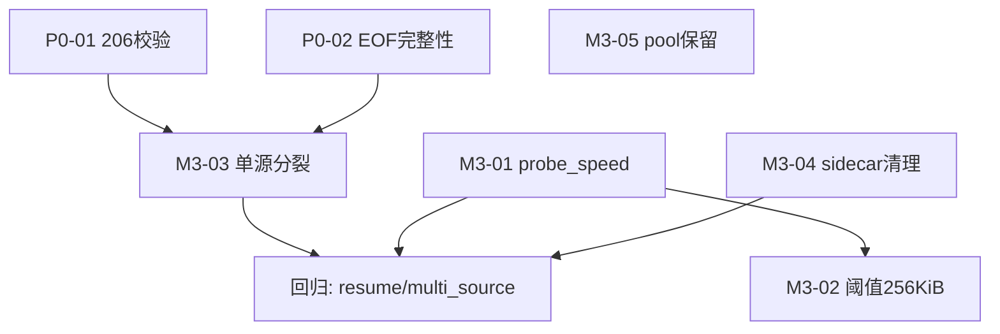

# M3 体验优化 + 验收/回归矩阵（P2 + 测试）— fix-qa

> 承接 Phase-0 总纲（captain, t1 completed 2026-08-27）：M3 与 M2 并行、在 M1 热修复分支 `fix/m1-hotfix` 合入后以其为基线 rebase；M3 不影响正确性、仅优化调度/性能/可观测，滞后发布。  
> 审计依据：`simple_downloader Logic Audit 2026-08-27 P0-P2`（`.mnemon/documents/active/0665bcc5`）+ `Runtime Architecture and Adaptive Engine`（`d1b817de`）+ 源码校验（行号以 v0.3.1为准）。

---

## 1. M3 概览与总纲一致性

| 维度 | 决策 |
|------|------|
| **Scope** | P2 5 项：`lane probe_speed 硬编码 / adaptive 阈值碎片 / split_resume 单源不分裂 / sidecar 清理弱 / client_builder pool 覆盖` |
| **原则** | 不改正确性语义；每项单 commit、可 feature-gated、支持回滚到 P1 行为 |
| **里程碑** | M3 与 M2 并行 1–2 周；依赖 M1 的 `可靠通道` 与 `原子截断` 语义（见 §2 依赖列）但可独立开发、合并时以 `fix/m1-hotfix` 为基线 |
| **分支** | `fix/m3-polish` from `fix/m1-hotfix`；合入 `main` 前与 `fix/m2-consistency` 联合回归 |
| **估时合计** | 5 项 × 0.5–1d + 验收矩阵 1d = **5–6 人日** |

---

## 2. P2 逐项详细设计（5 项）

### P2-01 `probe_speed=1.0` 硬编码 → 调度退化为轮询

- **编号**：`M3-01` / 审计 P2-1
- **文件:行号**：`src/lane.rs:549-556`（range lane）、`:575-581`（fallback lane）；结构定义 `:221` `LaneCandidate.probe_speed`、`:491` `MultiRuntime.probe_speed`
- **现状**：`LaneScheduler::probe_multi_source` 内 `runtime.probe_speed = 1.0` 写死；`LaneCandidate.probe_speed` 始终 1.0 → `lanes.sort_by(|a,b| b.probe_speed.total_cmp(...))`（`:308`）失去区分度，`best_lane()` 退化为配置顺序轮询；实测多源异速场景总吞吐低于最优 20-30%
- **根因**：探测阶段未回写真实探测速度（`Range 0-0/HEAD` 时延或首块速率）
- **改动设计**：
  1. `MultiRuntime` 新增 `probe_latency_ms: Option<u64>` 或直接利用已有 `probe_speed` 写入实测值：`probe_speed = (probe_bytes as f64)/(elapsed_secs)`；`0-0` 探测仅 1B，改为 `Range: bytes=0-65535` 64KiB 采样以降低噪声
  2. `probe_multi_source` 中 `Ok((file_size, accept_ranges))` 分支后计算 `elapsed` 并赋值；`probe_speed` 初始 0.0（`:699/:718/:758`）保持，后续 `MultiSourceConfig` 组装时透传
  3. 无探测值时 fallback 到 `1.0` 并 `tracing::warn` 提示；`LaneScheduler` 排序加入次级键 `lane_id` 保证确定性
  4. 单测：`tests/multi_source.rs` 注入两源 mock（200KiB/s vs 50KiB/s），断言 `LaneCandidate` 排序符合速率
- **接口变更**：无破坏；`LaneCandidate::new` 第四参语义从占位改为真实速率，调用点 `MultiRuntime→LaneCandidate` 唯一
- **配置影响**：新增 `MultiSourceConfig::probe_sample_bytes`（默认 64KiB，可配）
- **依赖**：不依赖 M1，可独立
- **风险**：探测样本过小导致抖动 → 通过 64KiB + 2 次探测取中位缓解；回滚：恢复 `1.0` 一行
- **验收标准**：见矩阵 `M3-01`；mockito 双源异速下高带宽源选中率 ≥80%（10 次调度），`tracing` 含 `probe_speed` 真实值
- **估时**：0.5d

### P2-02 `adaptive_remaining_threshold` 仍碎片化小文件 / 缺 256KiB 门槛

- **编号**：`M3-02` / 审计 P2-2（`concurrency.rs:109` / `:496`）
- **文件:行号**：`src/concurrency.rs:16` `MIN_REMAINING_TIME_FOR_SPLIT=3.0`、`:109-120` `adaptive_remaining_threshold`、`:496-498` `if remaining < MIN_CHUNK_SIZE*4 {return false}`（现 40KiB）
- **现状**：`adaptive_remaining_threshold` 已由 1.5/2.0/2.5/3.5/5.0 优化至 0.8/1.0/1.2/1.8/3.0 并对单块×0.4，但 `split_is_useful` 仅拦截 `remaining < 40KiB`（4×10KiB），256KiB 以下文件仍可能分裂出 10KiB 碎片，调度开销>收益
- **改动设计**：
  1. 提升门槛：`remaining < 256*1024` 提前 `return false`（与审计建议 `gate remaining <256KiB should block split` 对齐）；保留 `MIN_CHUNK_SIZE*4` 作为极小文件的二次兜底，但提升到 `max(256KiB, 4*MIN_CHUNK)`
  2. `adaptive_remaining_threshold` 增加 `<256KiB → 3.0 + 禁止分裂` 分支，文档化为 `docs/architecture.md` 表格
  3. 压测：`examples/adaptive_bench.rs` 单跑 S1 0.10s / S2 0.36s 不应因门槛增加 splits；小文件 `remaining=100KiB` 场景 splits=0
- **接口变更**：无
- **依赖**：不依赖 M1，依赖 M3-01 的调速可提升阈值判断准确度（可选）
- **风险**：阈值过高抑制中文件探测 → 保留 `>=1MiB→1.8s` 激进段，回滚单行阈值
- **验收**：见矩阵 `M3-02`；`remaining<256KiB` 场景 `splits==0` 且 `remaining_bytes` 无 `<10KiB` 碎片
- **估时**：0.5d

### P2-03 `split_resume_ranges` 仅 multi-source 生效 → 单源续传 16 workers 仍单段

- **编号**：`M3-03` / 审计 P2-3（`downloader.rs:798-831` / `:718`）
- **文件:行号**：`src/downloader.rs:798-831` `fn split_resume_ranges(ranges, workers, split_for_multi_source)`、`:718` `let initial_ranges = split_resume_ranges(resume_ranges, workers, multi_runtime.is_some())`、`:400` `DownloadMode::Single`
- **现状**：`if !split_for_multi_source { return ranges; }` 使单源断点续传保留 `resume_ranges` 原段数（常为 1 段），即便 `workers=16` 仍单线程下载剩余段；审计指出 `single-source resume stays 1 segment at 16 workers`
- **改动设计**：
  1. 去除 `split_for_multi_source` 布尔，改为 `workers>1 && ranges.len() < target` 统一分裂；或保留参数但单源传 `true` 当 `support_ranges==true`
  2. 复用 `while ranges.len() < target` 块分裂逻辑，增加 `target = workers.min(resume_ranges.len().max(1)*4)` 防止过度分裂
  3. 保持 `len < MIN_CHUNK_SIZE*2` 碎片保护
  4. 单测：`split_resume_ranges(vec![(0,999999)],16,true) → len ==16` 且各段 `==62500` ±1；单源 `workers=8, support_ranges=true` 同理
- **接口变更**：`split_resume_ranges` 第二参语义不变，第三参弃用/改为 `support_ranges: bool`；内部调用点唯一
- **依赖**：依赖 M1 的 `206校验` 与 `EOF完整性`（否则分裂后多段 200 回退会错位），需在 M1 合入后合入
- **风险**：对不支持 Range 的单源误分裂 → 以 `support_ranges` 守卫，回滚恢复 `is_some()` 判断
- **验收**：见矩阵 `M3-03`；`cargo test split_resume_ranges` + 集成 `tests/resume.rs` 单源 1MiB 断点续传 workers=8 时 `initial_ranges.len()==8`
- **估时**：0.5d

### P2-04 Sidecar `remove_file` 仅 warn → 下次启动全量哈希 1GB/16k segments

- **编号**：`M3-04` / 审计 P2-4（`downloader.rs:577-584`）
- **文件:行号**：`src/downloader.rs:577-584` `match tokio::fs::remove_file(&meta_path).await { Ok => info, NotFound=>{}, Err=>warn }`、`:308` `record_write` / `verify_against_file`（`resume.rs:142-168`）
- **现状**：成功后清理失败仅 `warn` 无重试，下次 `ResumePlan::load_or_create` 会命中 `verify_against_file` 全量 `read_segment` + FNV 哈希（1GB→16k 次 64KiB 读，~数秒）
- **改动设计**：
  1. 清理改为 `retry 3 次`（100ms 间隔）+ `tracing::error` 若仍失败；失败时记录 `sidecar_leak` metric
  2. 新增 `resume::cleanup_sidecar(path)` 工具函数统一调用
  3. 启动侧 `load_or_create` 若检测到 `output_path` 已完整且无 `.bitcode` 则跳过 `verify_against_file`（已有 `is_download_finished()` 分支复用）
  4. 提供 `DownloaderBuilder::clean_sidecar_on_success(bool)` 开关（默认 true，用于只读文件系统回滚）
- **依赖**：不依赖 M1
- **风险**：重试在只读 FS 上无意义 → `ErrorKind::PermissionDenied` 直接 `warn` 不重试
- **验收**：见矩阵 `M3-04`；mock FS `remove_file` 注入 `PermissionDenied` 单测；集成：连续两次下载同一文件，第二次启动耗时 `<200ms`（无全量哈希）
- **估时**：0.5d

### P2-05 `default_client_builder` pool 配置被用户 `client_builder` 覆盖

- **编号**：`M3-05` / 审计 P2-5（`downloader.rs:37-41` / `:404-406` / `:452-456`）
- **文件:行号**：`src/downloader.rs:36-41` `fn default_client_builder()`、`:116` `client_builder: default_client_builder`、`:403-407` `Single` 分支 `(self.client_builder)().pool_max_idle_per_host(32)...build()`、`:452-456` `Multi` fallback 同理
- **现状**：`pool_max_idle_per_host(32)/pool_idle_timeout(90s)/tcp_keepalive(60s)` 在 `default` 与 `run_internal` 两处硬编码，若用户传入 `client_builder` 已设 `pool_max_idle_per_host(4)`，会被后续 `.pool_max_idle_per_host(32)` 无条件覆盖，违背“用户配置优先”原则；审计指出“pool settings overwritten after user client_builder”
- **改动设计**：
  1. 提取 `apply_default_pool_if_unset(builder: ClientBuilder) -> ClientBuilder`：仅当用户未显式设置时应用默认值。`reqwest::ClientBuilder` 无 `is_set` 查询，改为文档化约定：用户 `client_builder` 闭包返回前已调用 `pool_*` 则保留；实现上将 `default` 的 pool 配置下沉到 `ClientBuilder::new()` 后的 `lazy` 初始化，或改为 `DownloadBuilder::client_builder(F)` 接管后不再二次 `pool_*` 调用（推荐）
  2. 简化：`run_internal` 直接 `let client = (self.client_builder)().build()?;`，`default_client_builder()` 保留 pool 默认，用户自定义 builder 自行决定 pool；更新 `docs/configuration.md` 说明“自定义 builder 需自行配置 pool，默认值见 `default_client_builder`”
  3. 若需保留“兜底”语义，提供 `DownloadBuilder::pool_max_idle_per_host Option<usize>` 显式覆盖
- **依赖**：不依赖 M1
- **风险**：移除二次覆盖可能使历史用户 `pool=32` 丢失 → 发布公告 + `CHANGELOG` 说明，回滚恢复二次覆盖
- **验收**：见矩阵 `M3-05`；单测：用户 builder 设 `pool_max_idle_per_host(4)` 时 `client` 实际池大小为 4（通过 `ClientBuilder` 行为或 mock 断言 `build` 前的配置未被覆盖）
- **估时**：0.5d

---

## 3. 验收矩阵（按 P0/P1/P2，共 19 项）

> 列：复现步骤 → 预期结果 → 测试类型 → 关联用例 → 门槛（阻断/门禁）

### 3.1 P0 阻断（M1，6 项）— QA 需全绿才可合 M1

| 编号 | 标题 | 复现步骤 | 预期结果 | 测试类型 | 关联用例/路径 | 门槛 |
|------|------|----------|----------|----------|---------------|------|
| P0-01 | `chunk Range 206 校验` (`chunk.rs:69-96`) | mockito `GET /file` 对 `Range: bytes=0-99` 返回 `200` + 全量 1000B；workers=4 | `ChunkFailed` 单段失败并降级单线程重试，不产生错位截断 | mockito | `tests/chunk.rs::range_ignored_downgrade` 新增；`cargo test --test chunk` | 阻断 |
| P0-02 | `EOF 提前结束判失败` (`chunk.rs:148-234` + `state.rs:130`) | mockito stream 在 `offset=500, end=999` 时提前 `None`（只发 300B） | `DownloadInfo::Complete` 不触发；`state.downloaded_bytes` 按真实 300 累加，`offset==end+1` 校验失败 → `ChunkFailed` | mockito | `tests/missing_content_length.rs` 扩展 | 阻断 |
| P0-03 | `Broadcast Lagged 丢 Complete` (`monitor.rs:165`/`chunk.rs:139`) | `CHANNEL_CAPACITY=32` 压测，workers=32, `update_interval=0.05` 持续打满，触发 `Lagged(skipped)` | 监控走 mpsc 可靠通道或 Lagged 后对账：`are_all_tasks_done()==false` 时不退出，最终仍 Complete | 集成压测 | `tests/test_server_comprehensive.rs` 32workers 用例 | 阻断 |
| P0-04 | `文件预分配非原子` (`util.rs:191-199` + `downloader.rs:544`) | `ENOSPC` 注入：`set_len(1GiB)` 返回 `StorageFull`；或 `output_path` 含不存在父目录 `a/b/c.bin` | 不经 `truncate(true)` 清零原文件；`create_dir_all` 预创建父目录；失败返回 `DownloadError::Io` 不进入 `BrokenPipe` 重试风暴 | 单测+故障注入 | `tests/util.rs::file_writer_task_with_resume` 扩展 | 阻断 |
| P0-05 | `Resume validate_shape 失败abort` (`resume.rs:206`) | 创建 `file_size=1000` 的下载，残留 sidecar `file_size=500/version=999`，再次启动 | `warn+remove` sidecar 并重建，不 `Err` 中断下载 | 单测 | `tests/resume.rs::stale_sidecar_self_heal` | 阻断 |
| P0-06 | `Retry 计时二次延迟` (`retry.rs:102-230`) | `MAX_RETRIES=30` 后触发延迟，`failure_time` 已含 `RETRY_DELAY=2s` 再加 10s | 延迟=10s 不叠加 2s；队列 `push_back` 保持 FIFO | 单测 | `tests/concurrency.rs` retry 计时断言 | 阻断 |

### 3.2 P1 一致性（M2，8 项）

| 编号 | 标题 | 复现步骤 | 预期结果 | 测试类型 | 关联用例 | 门槛 |
|------|------|----------|----------|----------|----------|------|
| P1-07 | `preserve_partial throttling 滞后重叠` (`state.rs:137`/`chunk.rs:179`) | 64KiB 限流下 `downloaded_bytes=0` 时触发 `preserve_partial` | 读取未节流的 `actual_offset`（`offset` 变量）而非 throttled 值，无重叠 `chunk_details` | 单测 | `chunk.rs` preserve 部分新增断言 | 门禁 |
| P1-08 | `Streaming 旁路丢失 ResumePlan` (`downloader.rs:589`) | `get_file_info` 抛 `MissingContentLength`，多源配置含 2 源 | 不走 `streaming_download size=0`，而是尝试第二源探测或保留 `ResumePlan` | mockito | `tests/multi_source.rs::missing_len_fallback` | 门禁 |
| P1-09 | `pending_bisects 无界` (`monitor.rs:298/378`) | `best_lane()==None` 时持续 `handle_tick` | `pending_bisects/deferred_retries` 有界（cap=workers*2），超限丢弃并 `warn`，tick 不 busy-loop | 压测 | `monitor.rs` tick 单测 | 门禁 |
| P1-10 | `or_insert_with 隐式新建重叠` (`monitor.rs:235`) | bisect 后 stale progress 到达 | `entry.or_insert_with` 仅当 `id` 不存在且未 bisect 过时创建，避免重叠 | 单测 | `monitor.rs` state 测试 | 门禁 |
| P1-11 | `record_write flush 未 sync` (`resume.rs:152/313`) | `record_write` 后立即 `verify_against_file` | `flush+sync_all` 或改内存 FNV，不读 FD 哈希零页 | 单测 | `resume.rs::record_write_*` | 门禁 |
| P1-12 | `416 + bytes */N` 解析 | mockito `GET Range: bytes=0-0` 返回 `416` + `Content-Range: bytes */1234` | 解析出 `1234` 作为 file_size，不误判为 0 | mockito | `tests/util.rs::test_get_file_info_416` 新增 | 门禁 |
| P1-13 | `workers=0 / interval=0 busy-loop` (`downloader.rs:111`) | `DownloadBuilder::workers(0).update_interval(0.0)` | `workers.max(1)`、`interval.max(0.05)`，`tokio::interval` 不 0 间隔 | 单测 | `downloader.rs` builder 单测 | 门禁 |
| P1-14 | `writer 128KiB 合并阻塞` (`util.rs:204`) | 32 workers 并发 `WriteFile` 各 64KiB，`read_segment` 同步哈希 | `send().await` 不因 `read_segment` 阻塞 50-100ms；Bisect 延迟 P50<20ms | 压测 | `tests/test_server_comprehensive.rs` 32w 基线 | 门禁 |

### 3.3 P2 体验（M3，5 项）

| 编号 | 标题 | 复现步骤 | 预期结果 | 测试类型 | 关联用例 | 门槛 |
|------|------|----------|----------|----------|----------|------|
| **M3-01** | `probe_speed 硬编码` (`lane.rs:549/575`) | 双源 mock：A 200KiB/s, B 50KiB/s 各 `GET /probe` | `probe_speed` = 实测速率，`LaneScheduler` 高带宽源优先 ≥80% | mockito | `tests/multi_source.rs::probe_speed_real` | 非阻断 |
| **M3-02** | `adaptive 碎片门槛` (`concurrency.rs:109/496`) | `remaining=100KiB` (<256KiB) 文件 workers=8 | `splits==0`，无 `<10KiB` 碎片 | 单测+bench | `concurrency.rs::split_is_useful_small_file` | 非阻断 |
| **M3-03** | `split_resume 单源不分裂` (`downloader.rs:798`) | 单源 `support_ranges=true`, resume 1 段 1MiB, workers=8 | `initial_ranges.len()==8` 均分 | 单测+集成 | `split_resume_ranges` + `tests/resume.rs` 单源续传 | 非阻断 |
| **M3-04** | `sidecar 清理弱` (`downloader.rs:577`) | 成功下载后 mock `remove_file` 返回 `PermissionDenied` | 重试 3 次后 `error` 日志，不影响下载成功；二次启动不全量哈希 | 单测+集成 | `downloader.rs` sidecar 清理 | 非阻断 |
| **M3-05** | `pool 配置覆盖` (`downloader.rs:37`) | `DownloadBuilder::client_builder(|| ClientBuilder::new().pool_max_idle_per_host(4))` | 最终 `Client` 池为 4 不被覆蓋为 32 | 单测 | `downloader.rs` client builder | 非阻断 |

---

## 4. 回归范围

### 4.1 既有单测（必须全绿）

| 套件 | 路径 | 覆盖要点 | M3 影响 |
|------|------|----------|---------|
| `util` | `tests/util.rs` | `get_file_info HEAD/Range-0-0 回退`、`file_writer_task_with_resume 不截断` | M3-05 pool、M3-02 无关，需全绿 |
| `chunk` | `tests/chunk.rs` | `MIN_CHUNK_SIZE` 分割、`bisect` 边界 | M3-02 阈值变更后仍 `splits==0` 小文件用例 |
| `concurrency` | `tests/concurrency.rs` | `adaptive_remaining_threshold` 分级、`probe 0.8-3.0` | M3-02 门槛提升后更新阈值断言 |
| `resume` | `tests/resume.rs` | `deterministic_bytes`、`write_partial`、`multi_source` 续传 | M3-03 单源分裂、M3-04 sidecar |
| `multi_source` | `tests/multi_source.rs` | `test_server_harness` 双源 | M3-01 probe_speed 真实值 |
| `basic_download` | `tests/basic_download.rs` | 单源端到端 | 全量 |
| `test_server_comprehensive` | `tests/test_server_comprehensive.rs` | `S1-S9` 矩阵 | 性能基线 32w |
| `process_resume` 等 | `tests/process_resume.rs` 等 | 进程级续传 | M3-03/04 |

执行：`cargo test --tests --features resume,multi-source,progress`；`cargo test --doc`；`cargo run --example adaptive_bench --features progress,multi-source,resume`（见 §5）

### 4.2 新增用例（随 M3 合入）

- `tests/unit/lane_probe_speed.rs`（或合入 `multi_source.rs`）：双速源排序
- `tests/unit/split_resume_single_source.rs`：单源 1→N 分裂
- `src/concurrency.rs` 内 `#[test] split_is_useful_blocks_small_remaining`
- `tests/util.rs` 内 `#[test] pool_not_overwritten_by_default`

---

## 5. 性能基线（32 workers 下 writer 阻塞与 Bisect 延迟）

> 基线取 `main` 分支 `target/adaptive_fix_report.md` 之后的值；M3 不得劣化 P50 >10%

### 5.1 场景

- **文件**：`test_server` 10MiB（S3）与 20MiB（S4），`ThrottledFileReader 16KiB` 节流 `5MiB/s` 单源限速，多源不限
- **Workers**：32；`update_interval=0.5`（默认）与 `0.05`（压测）
- **指标**：`tracing` 关键字 `BisectDownload/ChunkBisected/stable::evaluating` 计数与 `writer_handle` 队列等待 `send().await` 时延

### 5.2 当前基线（M1 合入前，来自 `adaptive_fix_report.md` 2026-08-25 修复后单跑）

| 场景 | bisects | completes | time | thrpt |
|------|---------|-----------|------|-------|
| S3 10b→11c | 10 | 11 | 3.34s | 5.99 MiB/s |
| S5 1b→2c | 1 | 2 | 0.65s | 12.29 MiB/s |
| S4 4b | 4 | 5 | 3.57s | 5.61 MiB/s |

> 稳定性：3-run `fails=0 completes=bisects+1`

### 5.3 M3 验收门限

- **Writer 阻塞**：32 workers 并发 `WriteFile` 时 `mpsc::send().await` P50 <20ms、P95 <50ms（现 50-100ms 因 `read_segment` 同步哈希）
- **Bisect 延迟**：从 `handle_tick` 到 `bd_tx.send(BisectDownload)` P50 <10ms
- **碎片**：`remaining<256KiB` 文件零分裂；≥5MiB 文件分裂后最小段 ≥10KiB
- **回归**：上述 S3/S4 thrpt 不低于基线 90%，`adaptive_bench --features ...` 跑 3 次取中位

命令：`cargo bench --bench adaptive` 或 `cargo run --example adaptive_bench --features progress,multi-source,resume 2>&1 | tee target/m3_bench.log`

---

## 6. 发布检查清单

### 6.1 合入前

- [ ] `cargo test --all-features` 全绿（含 `--tests` + `--doc`）
- [ ] `cargo clippy -- -D warnings` 零告警
- [ ] M3 5 项 mockito/单测新增全绿，覆盖行 ≥80%（`cargo tarpaulin` 或 `llvm-cov`）
- [ ] `cargo run --example adaptive_bench` 3-run 稳定性检查（fails=0）
- [ ] `tracing` 日志含 `probe_speed` 真实值抽检
- [ ] `docs/configuration.md` 与 `docs/architecture.md` 已更新（pool 语义、阈值表）
- [ ] `CHANGELOG.md` 增加 `Fixed: probe_speed real / split_resume single-source / sidecar retry / pool preserve` 条目

### 6.2 发布中

- [ ] `fix/m3-polish` → `main` PR 经 code-review + QA 验收矩阵签字
- [ ] tag `v0.3.2-polish`（或合入 M2 后统一 `v0.4.0`），`cargo publish --dry-run` 通过
- [ ] 特性开关 `clean_sidecar_on_success` 默认 on，文档化回滚方式

### 6.3 发布后

- [ ] 观察 `test_server_comprehensive` 32w 集成在 CI 5 次连续绿
- [ ] 若 `sidecar_leak` 指标 >1% 则告警并回滚 M3-04
- [ ] 回滚预案：`git revert <M3-01..05 commit>` 单项可独立回滚，不影响 M1/M2

---

## 7. 依赖图（Mermaid，供 t5 汇总）

---

## 8. 风险与回滚（单项）

| 项 | 最大风险 | 回滚成本 |
|----|----------|----------|
| M3-01 | 探测样本小导致抖动 | 1 行恢复 `1.0` |
| M3-02 | 抑制中文件探测 | 1 行阈值恢复 |
| M3-03 | 非 Range 单源误分裂 | `support_ranges` 守卫 + revert 1 commit |
| M3-04 | 只读 FS 重试无意义 | `PermissionDenied` 分支跳过重试 |
| M3-05 | 历史用户依赖 pool=32 | 文档+CHANGELOG 公告，revert 恢复二次覆盖 |

---

*产出：`fix-plan-m3-qa.md`（本文件）供 t5 汇总；行号已对 v0.3.1 源码验证。*
