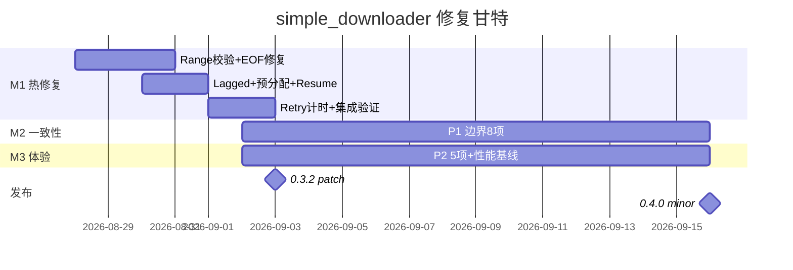
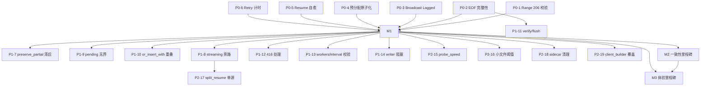

# simple_downloader 分级修复计划 — 总纲 (Phase-0)

> 版本: 2026-08-27 · 基于 `simple-downloader-logic-audit 2026-08-27 P0-P2` (AgentTeams t1/t2/t3 联合审计，覆盖 `src/chunk.rs / state.rs / monitor.rs / downloader.rs / concurrency.rs / lane.rs / retry.rs / resume.rs / util.rs / types.rs`，v0.3.1，`workers≤32 / broadcast 4096 / mpsc 128 / tick 0.5s / EMA 0.30`)
> 目标：24+ 缺陷 → 3 里程碑可执行路线图，零回归、可回滚、可验证

---

## 1. 分级原则

### 1.1  severity 定义

| 等级 | 命名 | 判定标准 | 准入条件 |
|------|------|----------|----------|
| **P0 阻断** | 数据损坏 / 挂死 / 丢失 | 单次运行即可触发静默错数据、零填充尾部、永不结束、无限重试 | 必须进入 M1 热修复；无 workaround；修复前禁止发版 |
| **P1 一致性** | 边界/一致性/资源 | 多源、断点续传、小文件、异常 HTTP 状态下行为不一致或资源泄漏/空转 | 进入 M2；依赖 M1 完成或可并行但需回归验证 |
| **P2 体验/性能** | 性能/打磨 | 不影响正确性，但导致吞吐下降、CPU 占用、用户可观测行为差 | 进入 M3；可与 M2 并行，发布前完成 |

**排序规则**：`正确性 > 可用性 > 性能 > 体验`。同级内按 `复现成本 × 影响面` 排序（例如 P0 中 `Range 206 校验` 与 `EOF 完整性` 优先于 `Retry 计时`）。

### 1.2 审计映射

- **P0 6 项**：① `chunk.rs:69-96` Range 忽略 ② `chunk.rs:148-234 + state.rs:130` Early-EOF 误判完成 ③ `monitor.rs:165 / chunk.rs:139` Broadcast Lagged 丢 Complete ④ `util.rs:191-199 + downloader.rs:544` 预分配非原子 ⑤ `resume.rs:206` validate_shape 失败即 abort ⑥ `retry.rs:102-230` 计时漂移+ FIFO 破坏
- **P1 8 项**：⑦ `state.rs:137 / chunk.rs:179` preserve_partial 读节流滞后值 ⑧ `downloader.rs:589` streaming 旁路丢失 ResumePlan ⑨ `monitor.rs:298/378` pending 无界 ⑩ `monitor.rs:235` or_insert_with 隐式建 State ⑪ `resume.rs:152/313` verify/file_len 与 flush 未 sync ⑫ `util.rs:26` 416 bytes 解析 ⑬ `downloader.rs:111` workers/interval 0 合法性 ⑭ `util.rs:204` writer 128KiB+同步哈希阻塞
- **P2 5+ 项**：⑮ `lane.rs:549` probe_speed=1.0 ⑯ `concurrency.rs:109` 小文件仍分片 ⑰ `downloader.rs:798` split_resume_ranges 单源不分裂 ⑱ `downloader.rs:577` sidecar 清理仅 warn ⑲ `downloader.rs:37` default_client_builder 覆盖用户配置 等

> 说明：审计报告列 24 项以下，拆分后实际卡片 19+，其余为上述项的子项分解，M1/M2/M3 任务卡片中展开。

---

## 2. 里程碑划分

### M1 — 热修复 (Hotfix) · 目标：7 天内合入，单独发 `0.3.2`

- **范围**：P0 6 项
- **分支**：`fix/m1-hotfix-p0` 自 `main` 切出
- **门禁**：6 项每项均有独立复现用例 + 修复后 `cargo test --all-features` 全绿 + `cargo run --example adaptive_bench` 不回归
- **交付物**：`docs/fix-plan-m1-hotfix.md`（本计划 t2 输入） + 6 个 commit（每项一 commit，便于 cherry-pick 回滚）
- **发布策略**：合 main 后打 `0.3.2` patch；若任意 P0 回滚则整 M1 回滚

### M2 — 一致性 (Consistency) · 目标：M1 合入后 2 周，`*0.4.0*` 或 `0.3.3`

- **范围**：P1 8 项
- **分支**：`fix/m2-consistency-p1` 自 `main`（已含 M1）切出，可与 M3 并行开发但合入顺序 M2 优先
- **门禁**：边界用例（416/0-length/小文件 <1MiB/32 workers 压测/multi-source 单源混合）+ 现有 `tests/*.rs` 回归
- **依赖**：⑦ 依赖 M1 的 EOF 修复；⑨/⑩ 依赖 M1 的 Lagged 修复；其余可与 M1 并行开发但需在 M1 分支上验证

### M3 — 体验与性能 (Polish) · 目标：与 M2 并行，M2 后 1 周合入，发 `0.4.0`

- **范围**：P2 5+ 项 + M1/M2 遗留调优
- **分支**：`fix/m3-polish-p2` 自 `main`（已含 M1）切出
- **门禁**：`examples/adaptive_bench.rs` 吞吐对比 + 32 workers writer 阻塞 profiling + 发布检查清单
- **发布策略**：与 M2 合并后发 `0.4.0` minor（因含 `split_resume_ranges` 行为变更与 `client_builder` 语义变更）

**甘特（示意）**：

---

## 3. 分支 / 发布 / 配置策略

| 维度 | 策略 |
|------|------|
| **分支模型** | `main` 常绿；`fix/m1-* / fix/m2-* / fix/m3-*` 短分支；每项一 commit，commit message 前缀 `fix(P0-#):` / `fix(P1-#):` |
| **合并策略** | M1 → squash 前需保留 6 commit 供回滚；M2/M3 → rebase 后 merge --no-ff 保留 milestone 标记 |
| **发布** | M1 单独 `0.3.2` patch（仅 P0，semver 兼容）；M2/M3 合并后 `0.4.0` minor（行为变更需在 CHANGELOG 标注 Breaking-Adjacent） |
| **Feature 门禁** | `resume / multi-source / progress` 各组合 `cargo test --features all`；`resume` 相关改动需额外 `--features resume` 单测 |
| **配置兼容** | `workers` / `update_interval` 新增校验为软错误（clamp + warn），不直接 panic；`default_client_builder` 变更需文档化（见 M3） |

---

## 4. 风险与回滚预案

| 风险 | 缓解 | 回滚点 |
|------|------|--------|
| M1 中 Range 校验误判导致本可下载的非标准服务器降级失败 | 增加白名单：`200 + Content-Range` 亦视为支持；灰度 `mockito` 覆盖 `200/full-body/206` 三态 | 单 commit `git revert <P0-1>` |
| EOF 完整性收紧导致慢速服务器被误判失败 | 仅对 `offset != end+1` 且 `stream None` 判失败，超时由上层 `reqwest` 控制；保留 `allowed` 截断逻辑 | `git revert <P0-2>` |
| Broadcast → mpsc 改动引入死锁/背压 | M1 采用最小改动：Lagged 仅对 `Complete/Failed/Bisected` 做对账，不全量切 mpsc；M2 再评估全量 mpsc | `git revert <P0-3>` |
| 预分配原子化在 Windows 上 `set_len` 性能回退 | 保留 `truncate(true)` 路径仅当 `size>0` 且非 resume；否则 `set_len` 优先 | `git revert <P0-4>` |
| Resume validate_shape 自愈误删用户侧有效 sidecar | 仅当 `file_size/version/segment_size` 不一致时删除，且打 `warn` 日志；`target file missing` 仍保持 Err | `git revert <P0-5>` |
| Retry FIFO 调整导致重试饥饿 | 从 `push_front` 改 `push_back` 仅影响同 tick 内 deferred 顺序，已有 `process_queues` 排序保证 | `git revert <P0-6>` |

**全局回滚开关**：若 M1 合入后 CI 失败率 >5% 或 `adaptive_bench` 吞吐下降 >10%，整 M1 分支 `git revert -m 1 <merge-commit>` 并重发 `0.3.1`。

---

## 5. 依赖图（Mermaid）

---

## 6. 验收总则

- **每项必备**：复现脚本（`mockito` 或 `test_server/server.py` 限速/异常注入）+ 预期结果（文件 `sha256` 一致 / 事件序列 / 日志关键字）+ 回归用例位置
- **M1 门禁**：`cargo test --all-features` + `cargo test --features resume,multi-source,progress` + `tests/resume.rs` + `tests/multi_source.rs` + `tests/missing_content_length.rs`
- **M2 门禁**：新增 `tests/p1_boundary.rs`（416/零长/小文件/32 workers）全绿
- **M3 门禁**：`adaptive_bench` S3/S4/S5 吞吐不低于 M1 基线；`tokio-console` / `perf` 观察 writer 阻塞 <10ms p95
- **发布检查清单**：见 `docs/fix-plan-m3-polish.md`（t4 产出）中的 `Release Checklist`，含 CHANGELOG、docs 同步、版本 bump、sidecar 兼容声明

---

## 7. 下一步分工

| 任务 | 负责人 | 输入 | 输出 |
|------|--------|------|------|
| t2 M1 热修复详细设计 | fix-architect | 本总纲 + 6 文件行号核验 | `docs/fix-plan-m1-hotfix.md`（6 卡片） |
| t3 M2 一致性详细设计 | fix-engineer | 本总纲 | `docs/fix-plan-m2-consistency.md`（8 卡片） |
| t4 M3 体验+验收矩阵 | fix-qa | 本总纲 | `docs/fix-plan-m3-polish.md`（5+ 卡片 + 矩阵） |
| t5 汇总可执行看板 | captain | t2/t3/t4 | `docs/fix-plan.md`（含看板与 Mermaid 依赖图） |

> 约束：不动代码，只产出计划；所有设计文档需标明 `文件:行号` 可验证；M1 的 6 项每项独立可回滚。
